<div class="MCWHeader1">
Modern cloud apps
</div>

<div class="MCWHeader2">
Hands-on lab step-by-step
</div>

<div class="MCWHeader3">
May 2021
</div>

Information in this document, including URL and other Internet Web site references, is subject to change without notice. Unless otherwise noted, the example companies, organizations, products, domain names, e-mail addresses, logos, people, places, and events depicted herein are fictitious, and no association with any real company, organization, product, domain name, e-mail address, logo, person, place or event is intended or should be inferred. Complying with all applicable copyright laws is the responsibility of the user. Without limiting the rights under copyright, no part of this document may be reproduced, stored in or introduced into a retrieval system, or transmitted in any form or by any means (electronic, mechanical, photocopying, recording, or otherwise), or for any purpose, without the express written permission of Microsoft Corporation.

Microsoft may have patents, patent applications, trademarks, copyrights, or other intellectual property rights covering subject matter in this document. Except as expressly provided in any written license agreement from Microsoft, the furnishing of this document does not give you any license to these patents, trademarks, copyrights, or other intellectual property.

The names of manufacturers, products, or URLs are provided for informational purposes only and Microsoft makes no representations and warranties, either expressed, implied, or statutory, regarding these manufacturers or the use of the products with any Microsoft technologies. The inclusion of a manufacturer or product does not imply endorsement of Microsoft of the manufacturer or product. Links may be provided to third party sites. Such sites are not under the control of Microsoft and Microsoft is not responsible for the contents of any linked site or any link contained in a linked site, or any changes or updates to such sites. Microsoft is not responsible for webcasting or any other form of transmission received from any linked site. Microsoft is providing these links to you only as a convenience, and the inclusion of any link does not imply endorsement of Microsoft of the site or the products contained therein.

© 2021 Microsoft Corporation. All rights reserved.

Microsoft and the trademarks listed at <https://www.microsoft.com/legal/intellectualproperty/Trademarks/Usage/General.aspx> are trademarks of the Microsoft group of companies. All other trademarks are property of their respective owners.

**Contents**

<!-- TOC -->
- [Modern cloud apps hands-on lab step-by-step](#modern-cloud-apps-hands-on-lab-step-by-step)
  - [Abstract and learning objectives](#abstract-and-learning-objectives)
  - [Overview](#overview)
  - [Solution architecture](#solution-architecture)
  - [Requirements](#requirements)
  - [Help references](#help-references)
  - [Exercise 1: Create Key Vault secrets and add to App Configuration](#exercise-1-create-key-vault-secrets-and-add-to-app-configuration)
    - [Task 1: Retrieve database connection string](#task-1-retrieve-database-connection-string)
    - [Task 2: Retrieve Storage Account access key](#task-2-retrieve-storage-account-access-key)
    - [Task 3: Retrieve Service Bus Queue connection string](#task-3-retrieve-service-bus-queue-connection-string)
    - [Task 4: Create secrets in Azure Key Vault](#task-4-create-secrets-in-azure-key-vault)
    - [Task 5: Centralize secrets for multiple projects using an App Configuration store](#task-5-centralize-secrets-for-multiple-projects-using-an-app-configuration-store)
  - [Exercise 2: Deploy e-commerce website](#exercise-2-deploy-e-commerce-website)
    - [Task 1: Configure SQL Database firewall](#task-1-configure-sql-database-firewall)
    - [Task 2: Connect to the Lab VM](#task-2-connect-to-the-lab-vm)
    - [Task 3: Open the Contoso Sports League starter solution in Visual Studio](#task-3-open-the-contoso-sports-league-starter-solution-in-visual-studio)
    - [Task 4: Configure the e-commerce Web App in Visual Studio](#task-4-configure-the-e-commerce-web-app-in-visual-studio)
    - [Task 5: Publish the web app to Azure](#task-5-publish-the-web-app-to-azure)
  - [Exercise 3: Setup SQL Database Geo-Replication](#exercise-3-setup-sql-database-geo-replication)
    - [Task 1: Add secondary database](#task-1-add-secondary-database)
    - [Task 2: Configure secondary SQL Database firewall](#task-2-configure-secondary-sql-database-firewall)
    - [Task 3: Setup SQL Failover Group](#task-3-setup-sql-failover-group)
    - [Task 4: Update database connection string to use failover listener endpoint](#task-4-update-database-connection-string-to-use-failover-listener-endpoint)
    - [Task 5: Failover SQL Database Failover Group](#task-5-failover-sql-database-failover-group)
    - [Task 6: Test e-commerce Web App after Failover](#task-6-test-e-commerce-web-app-after-failover)
  - [Exercise 4: Deploy the Call Center admin website](#exercise-4-deploy-the-call-center-admin-website)
    - [Task 1: Provision a Web App](#task-1-provision-a-web-app)
    - [Task 2: Update the configuration in the starter project](#task-2-update-the-configuration-in-the-starter-project)
    - [Task 3: Add a managed identity and set a Key Vault access policy](#task-3-add-a-managed-identity-and-set-a-key-vault-access-policy)
    - [Task 4: Configure and deploy the call center admin Web App from Visual Studio](#task-4-configure-and-deploy-the-call-center-admin-web-app-from-visual-studio)
  - [Exercise 5: Deploy the payment gateway](#exercise-5-deploy-the-payment-gateway)
    - [Task 1: Provision the payment gateway API App](#task-1-provision-the-payment-gateway-api-app)
    - [Task 2: Deploy the Payment Gateway from Visual Studio](#task-2-deploy-the-payment-gateway-from-visual-studio)
  - [Exercise 6: Deploy the Offers Web API](#exercise-6-deploy-the-offers-web-api)
    - [Task 1: Provision the Offers Web API App](#task-1-provision-the-offers-web-api-app)
    - [Task 2: Configure Cross-Origin Resource Sharing (CORS)](#task-2-configure-cross-origin-resource-sharing-cors)
    - [Task 3: Update the configuration in the starter project](#task-3-update-the-configuration-in-the-starter-project)
    - [Task 4: Add a managed identity and set a Key Vault access policy](#task-4-add-a-managed-identity-and-set-a-key-vault-access-policy)
    - [Task 5: Deploy the Offers app from Visual Studio](#task-5-deploy-the-offers-app-from-visual-studio)
  - [Exercise 7: Add API endpoint configuration settings](#exercise-7-add-api-endpoint-configuration-settings)
    - [Task 1: Add the API endpoint configuration settings](#task-1-add-the-api-endpoint-configuration-settings)
    - [Task 2: Validate App Settings are correct](#task-2-validate-app-settings-are-correct)
  - [Exercise 8: Identity and Security](#exercise-8-identity-and-security)
    - [Task 1: Enable Azure AD Premium Trial](#task-1-enable-azure-ad-premium-trial)
    - [Task 2: Create a new Contoso user](#task-2-create-a-new-contoso-user)
    - [Task 3: Configure access control for the call center administration Web Application](#task-3-configure-access-control-for-the-call-center-administration-web-application)
    - [Task 4: Apply custom branding for the Azure Active Directory logon page](#task-4-apply-custom-branding-for-the-azure-active-directory-logon-page)
    - [Task 5: Verify the branding has been successfully applied to the Azure Active Directory logon page](#task-5-verify-the-branding-has-been-successfully-applied-to-the-azure-active-directory-logon-page)
  - [Exercise 9: Enable Azure B2C for customer site](#exercise-9-enable-azure-b2c-for-customer-site)
    - [Task 1: Create a new directory](#task-1-create-a-new-directory)
    - [Task 2: Add a new application](#task-2-add-a-new-application)
    - [Task 3: Create Policies, Sign up and sign in](#task-3-create-policies-sign-up-and-sign-in)
    - [Task 4: Create a profile editing policy](#task-4-create-a-profile-editing-policy)
    - [Task 5: Create a password reset policy](#task-5-create-a-password-reset-policy)
    - [Task 6: Modify the Contoso.App.SportsLeague.Web](#task-6-modify-the-contosoappsportsleagueweb)
    - [Task 7: Send authentication requests to Azure AD](#task-7-send-authentication-requests-to-azure-ad)
    - [Task 8: Display user information](#task-8-display-user-information)
    - [Task 9: Update App Service configuration](#task-9-update-app-service-configuration)
    - [Task 10: Run the sample app](#task-10-run-the-sample-app)
  - [Exercise 10: Enabling Telemetry with Application Insights](#exercise-10-enabling-telemetry-with-application-insights)
    - [Task 1: Add Application Insights Telemetry to the e-commerce website project](#task-1-add-application-insights-telemetry-to-the-e-commerce-website-project)
    - [Task 2: Enable client side telemetry](#task-2-enable-client-side-telemetry)
    - [Task 3: Deploy the e-commerce Web App from Visual Studio](#task-3-deploy-the-e-commerce-web-app-from-visual-studio)
    - [Task 4: View the Application Insights logs](#task-4-view-the-application-insights-logs)
  - [Exercise 11: Automating backend processes with Azure Functions and Logic Apps](#exercise-11-automating-backend-processes-with-azure-functions-and-logic-apps)
    - [Task 1: Create an Azure Function to Generate PDF Receipts](#task-1-create-an-azure-function-to-generate-pdf-receipts)
    - [Task 2: Add Key Vault access using a managed identity](#task-2-add-key-vault-access-using-a-managed-identity)
    - [Task 3: Configure and deploy the Function App](#task-3-configure-and-deploy-the-function-app)
    - [Task 4: Create an Azure Logic App to Process Orders](#task-4-create-an-azure-logic-app-to-process-orders)
    - [Task 5: Use Twilio to send SMS Order Notifications](#task-5-use-twilio-to-send-sms-order-notifications)
  - [Exercise 12: Automate deployments using GitHub actions](#exercise-12-automate-deployments-using-github-actions)
    - [Task 1: Create a GitHub repository](#task-1-create-a-github-repository)
    - [Task 2: Commit the existing lab files to source control](#task-2-commit-the-existing-lab-files-to-source-control)
    - [Task 3: Create a service principal in Active Directory](#task-3-create-a-service-principal-in-active-directory)
    - [Task 4: Create repository secrets](#task-4-create-repository-secrets)
    - [Task 5: Define the production deployment workflow](#task-5-define-the-production-deployment-workflow)
    - [Task 6: Trigger the Production Deployment Workflow](#task-6-trigger-the-production-deployment-workflow)
  - [After the hands-on lab](#after-the-hands-on-lab)
    - [Task 1: Delete resources](#task-1-delete-resources)

<!-- /TOC -->

# Modern cloud apps hands-on lab step-by-step

## Abstract and learning objectives

In this hands-on lab, you will be challenged to implement an end-to-end scenario using a supplied sample that is based on Azure App Services, Microsoft Azure Functions, Azure SQL Database, Azure Logic Apps, and related services. The scenario will include implementing compute, storage, workflows, and monitoring, using various components of Microsoft Azure.

Please note that as opposed to the Whiteboard Design Session, the lab is not focused on maintaining PCI compliance and using more advanced security features such as App Service Environment, Network Security Groups, and Application Gateway. The hands-on lab can be implemented on your own, but it is highly recommended to pair up with other members at the lab to model a real-world experience and to allow each member to share their expertise for the overall solution.

By the end of this hands-on lab, you will have learned how to use several key services within Azure to improve overall functionality of the original solution, and to increase the security and scalability of the new and improved design.

## Overview

The Contoso Sports League Association (CSLA) is one of the largest sports franchises and is struggling to keep up with demand from their growing user base. They currently host an e-commerce website and have a backend website that supports their call center, allowing employees to view order information.

CSLA would like to modernize their websites and move to the cloud, ultimately moving away from managing infrastructure. They are interested in whether Platform-as-a-Service (PaaS) will meet their needs so they can completely remove the infrastructure management overhead. However, they are concerned about securing their websites and data to meet the stringent PCI (Payment Card Industry) compliance requirements.

## Solution architecture


## Requirements

1. Microsoft Azure subscription
2. Local machine or a virtual machine configured with Visual Studio 2019 Community Edition
3. Twilio account and/or personal cell phone to setup a trial Twilio account
4. A GitHub account and local installation of a Git client

## Help references

| Description | Links |
|---------|-------------|
| SQL firewall | <https://azure.microsoft.com/documentation/articles/sql-database-configure-firewall-settings/> |
| Deploying a Web App | <https://azure.microsoft.com/documentation/articles/web-sites-deploy/> |
| Deploying an API app | <https://azure.microsoft.com/documentation/articles/app-service-dotnet-deploy-api-app/> |
| Accessing an API app from a JavaScript client | <https://azure.microsoft.com/documentation/articles/app-service-api-javascript-client/> |
| SQL Database Geo-Replication overview | <https://azure.microsoft.com/documentation/articles/sql-database-geo-replication-overview/> |
| What is Azure AD? | <https://azure.microsoft.com/documentation/articles/active-directory-whatis/> |
| Azure Web Apps authentication | <http://azure.microsoft.com/blog/2014/11/13/azure-websites-authentication-authorization/> |
| View your access and usage reports | <https://msdn.microsoft.com/library/azure/dn283934.aspx> |
| Custom branding an Azure AD Tenant | <https://msdn.microsoft.com/library/azure/Dn532270.aspx> |
| Service Principal Authentication | <https://docs.microsoft.com/azure/app-service-api/app-service-api-dotnet-service-principal-auth> |
| Consumer Site B2C | <https://docs.microsoft.com/azure/active-directory-b2c/active-directory-b2c-devquickstarts-web-dotnet> |
| Getting Started with Active Directory B2C | <https://azure.microsoft.com/trial/get-started-active-directory-b2c/> |
| How to Delete an Azure Active Directory | <https://blog.nicholasrogoff.com/2017/01/20/how-to-delete-an-azure-active-directory-add-tenant/> |
| Run performance tests on your app | <http://blogs.msdn.com/b/visualstudioalm/archive/2015/09/15/announcing-public-preview-for-performance-load-testing-of-azure-webapp.aspx> |
| Application Insights Custom Events | <https://azure.microsoft.com/documentation/articles/app-insights-api-custom-events-metrics/> |
| Enabling Application Insights | <https://azure.microsoft.com/documentation/articles/app-insights-start-monitoring-app-health-usage/> |
| Detect failures | <https://azure.microsoft.com/documentation/articles/app-insights-asp-net-exceptions/> |
| Monitor performance problems | <https://azure.microsoft.com/documentation/articles/app-insights-web-monitor-performance/> |
| Creating a Logic App | <https://azure.microsoft.com/documentation/articles/app-service-logic-create-a-logic-app/> |
| Logic app connectors | <https://azure.microsoft.com/documentation/articles/app-service-logic-connectors-list/> |
| Logic Apps Docs | <https://docs.microsoft.com/azure/logic-apps/logic-apps-what-are-logic-apps> |
| Azure Functions -- create first function | <https://docs.microsoft.com/azure/azure-functions/functions-create-first-azure-function> |
| Azure Functions docs | <https://docs.microsoft.com/azure/logic-apps/logic-apps-azure-functions> |
| Deploy to Azure with GitHub Actions | <https://docs.microsoft.com/azure/developer/github/github-actions> |

## Exercise 1: Create Key Vault secrets and add to App Configuration

**Duration**: 15 minutes

In this exercise, you retrieve various keys and connection string from resources in the **hands-on-lab-SUFFIX** resource group and use them to create secrets in Key Vault. You will first copy connection string and keys into a text editor, such as Notepad.exe, for easier reference when creating secrets in Key Vault. You finish the exercise by adding references to the Key Vault into the App Configuration resource.

### Task 1: Retrieve database connection string

In this task, you retrieve the connection string for the ContosoSports DB SQL Database, set the password, and save it to a text editor, such as Notepad.exe.

1. In the [Azure portal](https://portal.azure.com), select **Resource groups** from the Azure services list.

   

2. Select the **hands-on-lab-SUFFIX** resource group from the list.

   

3. In the list of resources within your resource group, select the **ContosoSportsDB** SQL database resource.

   

4. On the **SQL Database** blade, select the **Show database connection strings** link within the Essentials area.

    

5. On the **Connection strings** blade, select the **Copy to clipboard** icon in the bottom right-hand corner of the `ADO.NET` connection string box.

    

6. Paste the copied connection string into a text editor, such as **Notepad.exe** and then replace the `{your_password}` token with `Password.1!!`.

7. In the tasks below, you will be copying additional values into the text editor, so you can have easy access to these values for creating secrets in Key Vault later in this hand-on lab. Leave the text editor open.

### Task 2: Retrieve Storage Account access key

In this task, you retrieve the access key for your Azure Storage account and save it to a text editor, such as Notepad.exe.

1. Return to the **hands-on-lab-SUFFIX** resource group and select the **contoso** Storage account resource from the list.

    

2. On the **Storage account** blade, select the **Access keys** in the left-hand navigation menu, and on the **Access keys** blade, select the **Show keys** and then copy the **key1** **Key** value by selecting the **Copy to clipboard** icon.

    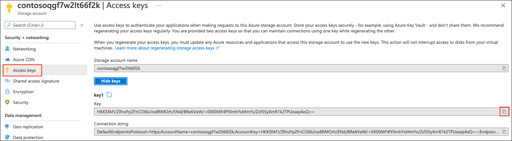

3. Paste the copied value into your open text editor for later reference, as you did with the database connection string above.

### Task 3: Retrieve Service Bus Queue connection string

In this task, you retrieve the primary connection string for the `receiptgenerator` Service Bus queue and save it to a text editor, such as Notepad.exe.

1. Return to the **hands-on-lab-SUFFIX** resource group and select the **Service Bus Namespace** resource from the list.

    

2. On the Service Bus Namespace blade, select **Queues** from the left-hand navigation menu, under the Entities header, and then select the `receiptgenerator` queue.

    

3. On the `receiptgenerator` Service Bus Queue blade, select **Shared access policies** in the left-hand navigation menu and then select the **Publisher** policy.

    

    >**Note**: The _Publisher_ and _Listener_ shared access policies for the Azure Service Bus Queue were deployed as part of the ARM Template that was used to setup the lab environment. Notice the **Publisher** policy only has permissions to _Send_ messages to the queue.
    >
    > By default, no policies are created. Additionally, it is best practice to use least privilege security to create separate shared access policies for publishers sending messages and listeners receiving messages from the queue.

4. On the **SAS Policy: Publisher** dialog, copy the **Primary Connection String** by selecting the **Copy to clipboard** icon.

    

5. Paste the copied value into your open text editor for later reference, as you did with the database connection string above.

### Task 4: Create secrets in Azure Key Vault

In this task, you create secrets in Key Vault for each of the connection strings and keys you retrieved in the tasks above.

1. Return to the **hands-on-lab-SUFFIX** resource group and select the **Key vault** resource from the list.

    

2. Select **Secrets** from the left-hand navigation menu and then select **Generate/Import**.

    

3. You will create three secrets in Key Vault, using the values you copied into your text editor. The secrets will be named according to the table below:

    | Name | Value |
    |------|-------|
    | AzureQueueConnectionString | Use the primary connection string you recorded for the Service Bus `receiptgenerator` queue |
    | ContosoSportsLeague | Use the database connection string |
    | contososportsstorage | Use the primary connection string you recorded for the storage account |

4. On the **Create a secret** blade, enter the following:

    - **Name**: Enter `AzureQueueConnectionString`.
    - **Value**: Paste the Service Bus queue primary connection string value into this box.

    > The remaining settings will retain their default values.

    

5. Select **Create**.

6. Select **Generate/Import** again and repeat steps 4 and 5 for the remaining two secrets specified in the table above, replacing the name and value settings with appropriate values.

7. You should end up with three secrets in Key Vault.

    

### Task 5: Centralize secrets for multiple projects using an App Configuration store

The Contoso Sports solution contains multiple projects, each of which access the same Azure resources. In this task, you centralize the configuration of the solution applications via the deployed Azure **App Configuration** resource.

1. Return to the **hands-on-lab-SUFFIX** resource group and select the **App Configuration** resource from the list.

    

2. Select **Configuration explorer** from the left-hand navigation menu and then select **Create** and **Key Vault reference**.

    

3. You will add a Key Vault reference for each of the three secrets you created in the previous task. The configuration values will be named according to the table below:

    | Key | Secret |
    |-----|--------|
    | ConnectionStrings:ReceiptQueue | Select **AzureQueueConnectionString** |
    | ConnectionStrings:ReceiptStorage | Select **contososportsstorage** |
    | ConnectionStrings:SportsDB | Select **ContosoSportsLeague** |

4. On the **Create** dialog, enter the following:

    - **Key**: Enter `ConnectionStrings:ReceiptQueue`.
    - **Subscription**: Select the subscription you are using for this hands-on lab.
    - **Resource group**: Select the **hands-on-lab-SUFFIX** resource group.
    - **Key Vault**: Choose the **key-vault-UNIQUE-ID** Key Vault resource.
    - **Secret**: Select the secret named `AzureQueueConnectionString`.

    

5. Select **Apply** on the Create dialog.

6. Select **Create --> Key Vault reference** again and repeat steps 4 and 5 for the remaining two keys specified in the table above, populating the **Key** and **Secret** fields with appropriate values.

## Exercise 2: Deploy e-commerce website

Duration: 15 minutes

In this exercise, you deploy the Contoso web app and provide the necessary configuration to display the e-commerce website.

### Task 1: Configure SQL Database firewall

In this task, you set up access to the Azure SQL Database from your local machine.

1. In the [Azure portal](https://portal.azure.com), select **Resource groups** from the Azure services list.

   

2. Select the **hands-on-lab-SUFFIX** resource group from the list.

   

3. In the list of resources within your resource group, select the **contososports** SQL Server resource.

   

4. On the **Overview** blade for the **SQL Server** resource, select the **Show firewall settings** in the Essentials area.

    

5. On the **Firewalls and virtual networks** blade, select **Add client IP** from the toolbar.

    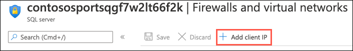

6. A new rule will be generated that contains your client IP address for the **Start IP** and **End IP**. This allows you to connect to the database from your machine.

    

7. Select **Save** on the toolbar.

    

8. Select **OK** on the **Success** dialog when it appears.

    

### Task 2: Connect to the Lab VM

In this task, you create an RDP connection to your Lab virtual machine (VM).

1. In the [Azure portal](https://portal.azure.com), select **Resource groups** from the Azure services list.

   

2. Select the **hands-on-lab-SUFFIX** resource group from the list.

   

3. In the list of resources within your resource group, select the **LabVM Virtual machine** resource.

   

4. On your LabVM blade, select **Connect** and **RDP** from the top menu.

   

5. On the Connect to virtual machine blade, select **Download RDP File**, then open the downloaded RDP file.

   

6. Select **Connect** on the Remote Desktop Connection dialog.

   

7. Enter the following credentials when prompted, and then select **OK**:

   - **User name**: demouser
   - **Password**: Password.1!!

   

8. Select **Yes** to connect if prompted that the remote computer's identity cannot be verified.

   

### Task 3: Open the Contoso Sports League starter solution in Visual Studio

1. On the LabVM, open File Explorer and navigate to the `C:\MCW\MCW-Modern-cloud-apps-master\Hands-on lab\lab-files\src\Contoso Sports League` folder.

2. From the **Contoso Sports League** folder, open the Visual Studio solution by double-clicking on the `Contoso.Apps.SportsLeague.sln` file.

3. If prompted about how to open the file, select **Visual Studio 2019** and then select **OK**.

   

4. Sign in to Visual Studio using your Azure account credentials.

   

5. If prompted with a security warning, uncheck **Ask me for every project in this solution**, and then select **OK**.

6. Using the Visual Studio Solution Explorer, expand each of the folders and notice the solution contains the following projects:

    | Project | Description |
    |:----------|:-------------|
    | Contoso.Apps.SportsLeague.Web |   Contoso Sports League e-commerce application |
    | Contoso.Apps.SportsLeague.Admin |   Contoso Sports League call center admin application |
    | Contoso.Apps.Common  |   Shared tier |
    | Contoso.Apps.SportsLeague.Data  |   Shared tier |
    | Contoso.Apps.FunctionApp  |   Function app tier |
    | Contoso.Apps.SportsLeague.Offers |  API for returning list of available products |
    | Contoso.Apps.PaymentGateway   |     API for payment processing |

   

### Task 4: Configure the e-commerce Web App in Visual Studio

1. Navigate to the `Contoso.Apps.SportsLeague.Web` project located in the **Web** folder using the **Solution Explorer** of Visual Studio.

    

2. Right-click the `Contoso.Apps.SportsLeague.Web` project, and select **Manage NuGet Packages** from the context menu.

3. Select the **Browse** tab, and search for **Microsoft.Azure.AppConfiguration.AspNetCore**.

4. Select **Microsoft.Azure.AppConfiguration.AspNetCore** from the search results, and in the next pane, select **Install** to install the latest stable version.

    

5. Repeat step 4-6, this time installing the latest **Azure.Identity**.

6. Now you are ready to configure this application to use the App Configuration in Azure. Expand the **Contoso.Apps.SportsLeague.Web** project and open the `Program.cs` file.

7. Uncomment the following **using** statements at the top of the file:

    ```csharp
    using Microsoft.Extensions.Configuration;
    using Azure.Identity;
    ```

8. In the **CreateHostBuilder** method, uncomment the following code. This tells the application to utilize the AppConfig connection string that you've already setup on the **contosoapp** application service to point to the centralized App Configuration resource.

    ```csharp
    webBuilder.ConfigureAppConfiguration((hostingContext, config) =>
    {
        var settings = config.Build();

        config.AddAzureAppConfiguration(options =>
        {
            options.Connect(settings["ConnectionStrings:AppConfig"])
                    .ConfigureKeyVault(kv =>
                    {
                        kv.SetCredential(new DefaultAzureCredential());
                    });
        });
    })
    .UseStartup<Startup>();
    ```

9. Save `Program.cs` by selecting Save on the Visual Studio toolbar.

### Task 5: Publish the web app to Azure

1. Right-click the **Contoso.Apps.SportsLeague.Web** project in the Visual Studio Solution Explorer and select **Publish**.

    

2. On the Publish dialog, select **Azure** as the **Target**, then select **Next**.

    

3. For **Specific target**, select **Azure App Service (Windows)**, then select **Next**.

    

4. On the **App Service** tab of the Publish dialog, select the appropriate subscription, then expand the **hands-on-lab-SUFFIX** resource group, select the **contosoapp** Web App from the list, and then select **Finish**.

    

5. Back in Visual Studio, select **Publish** to publish the Web application.

    

6. In the Visual Studio **Output** view, you will see a status that indicates the Web App was published successfully.

    

    >**Note**: Your URL will differ from the one shown in the Output screenshot because it must be globally unique.

7. A new browser should automatically open the new web applications. Validate the website by choosing the **Store** link on the menu. You should see product items. If products are returned, then the connection to the database was successful.

    

    >**Troubleshooting**: If the web site fails to start up or show products, go back and double check all your connection string entries and passwords web application settings. If you get a message indicating the Service is unavailable. Give it a moment, and refresh your browser.

## Exercise 3: Setup SQL Database Geo-Replication

**Duration**: 45 minutes (15 minutes if not performing optional failover)

In this exercise, the attendee will provision a secondary SQL Database and configure Geo-Replication using the Microsoft Azure Portal.

### Task 1: Add secondary database

1. In the [Azure portal](https://portal.azure.com), select **Resource groups** from the Azure services list.

   

2. Select the **hands-on-lab-SUFFIX** resource group from the list.

   

3. In the list of resources within your resource group, select the **ContosoSportsDB** SQL database resource.

   

4. On the **SQL Database** blade, select the **Show database connection strings** link within the Essentials area.

    

5. Select **Geo-Replication** in the left-hand navigation menu, under **Data management**.

    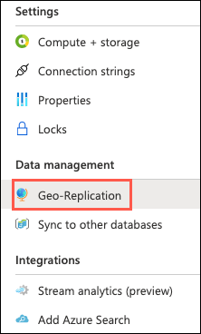

6. On the Geo-Replication blade, select the Azure Region within which you want to run the secondary database.

    

    > **Important**: The secondary Azure Region should be the Region Pair for the region the SQL Database is hosted in. Consult <https://docs.microsoft.com/azure/best-practices-availability-paired-regions> to see which region pair the location you are using for this lab is in.

    >**Note**: If you choose a region that cannot be used as a secondary region, you will not be able to pick a pricing plan. Choose another region.
    >
    > 

7. On the **Create SQL Database - Geo Replica** Basics tab, select **Create new** for the **Server** and in the New server dialog, enter:

    - **Server name**: Enter a globally unique value, such as `contosodbreplicaSUFFIX`, where `SUFFIX` is a unique identifier (ensure the green checkmark appears).
    - **Server admin login**: Enter `demouser`.
    - **Password**: Enter `Password.1!!`.
    - **Location**: Select the region you chose for your secondary region on the Geo-Replication screen.

    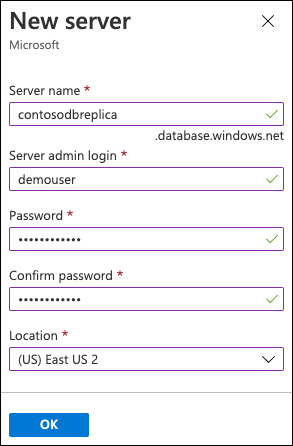

8. Select **OK** on the New server dialog.

9. Leave SQL elastic pool set to **No** and the Compute + Storage set to **Standard S1**. Select **Geo-redundant backup storage** for the **Backup storage redundancy**, and then select **Next: Networking**.

    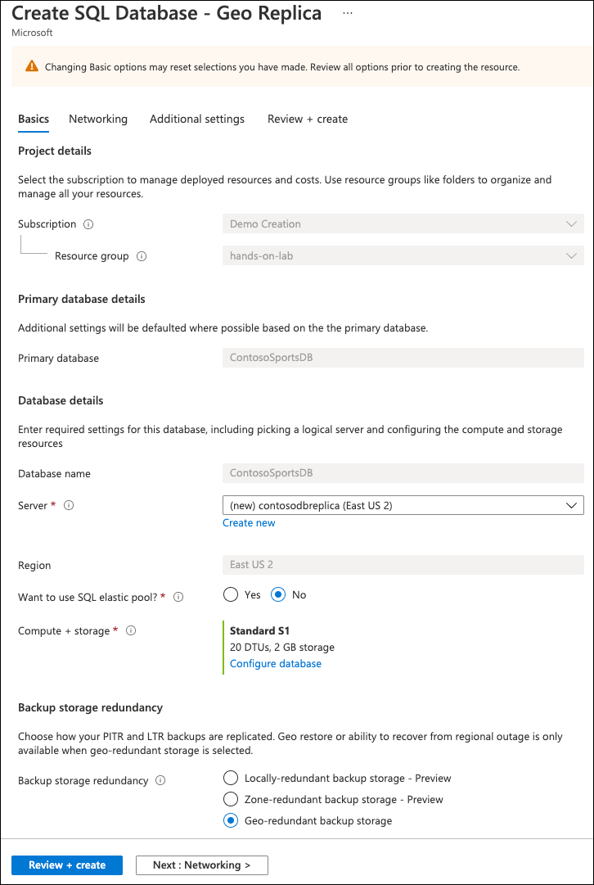

10. On the **Networking** tab, set **Allow Azure services and resources to access this server** to **Yes**.

    

11. Select **Review + create** and on the Review + create tab, select **Create** to start the deployment of the secondary database.

    > **Note**: Deployment of the secondary database for geo-replication takes several minutes to complete.

### Task 2: Configure secondary SQL Database firewall

In this task, you set up access to the secondary Azure SQL Database from your local machine.

1. After the Geo-Replication has finished provisioning, select **Go to resource** from the deployment blade.

    

2. In the Essentials area of the SQL database, select the **Server name** link to navigate to the SQL Server hosting the database.

    

3. On the **Overview** blade for the **SQL Server** resource, select the **Show firewall settings** in the Essentials area.

    

4. On the **Firewalls and virtual networks** blade, select **Add client IP** from the toolbar.

    

5. A new rule will be generated that contains your client IP address for the **Start IP** and **End IP**. This allows you to connect to the database from your machine.

    

6. Select **Save** on the toolbar.

    

7. Select **OK** on the **Success** dialog when it appears.

    

### Task 3: Setup SQL Failover Group

With SQL Database Geo-Replication configured, the Azure SQL Failover Groups feature can be used to enable "auto failover" scenarios for the SQL Database. This enables a single connection string endpoint to be used by the application, and SQL Database will automatically handle failing over from Primary to Secondary database in the event of a SQL Database outage / down time.

1. Return to the **hands-on-lab-SUFFIX** resource group and select the **contososports** SQL Server resource associated with the primary database.

   

2. On the **SQL server** blade, select **Failover groups** under **Data management** in the left-hand navigation menu.

    

3. On the **Failover groups** pane, select **Add group** on the toolbar.

    

4. On the **Failover group** pane, enter the following:

    - **Failover group name**: Enter a globally unique name, such as `contoso-failover-SUFFIX`.
    - **Server**: Select the secondary server you created above.
    - **Read/Write failover policy**: Choose **Automatic**.
    - **Read/Write grace period (hours)**: Choose **1 hours**.
    - **Database within group**: Select **Configure database**, check the box next to the **ContosoSportsDB** database on the replica, and then select **Select**.

    

5. Select **Create** to create the SQL Failover Group.

6. Once the Failover Group has been created, select it in the list.

    

7. On the **Failover group** pane, you will see a map displaying the locations of the _Primary_ and _Secondary_ SQL Database servers within the failover group. Below that, the _Primary_ database shows as **Automatic** failover for Read/Write of data, while the _Secondary_ database does not since it is currently Read only.

    

8. Below the map you will find the **Read/write listener endpoint** and the **Read-only listener endpoint**. These allow for applications to be configured to connect to the SQL Failover Group endpoints instead of the individual SQL Server endpoints. Copy both **Listener Endpoint** values and paste into a text editor, such as Notepad.exe, for later reference.

    

### Task 4: Update database connection string to use failover listener endpoint

In this task, you update the database connection string in Key Vault to use the read/write listener endpoint of the failover group.

1. Return to the **hands-on-lab-SUFFIX** resource group and select the **Key vault** resource from the list.

    

2. Select **Secrets** from the left-hand navigation menu and then select the **ContosoSportsLeague** secret.

    

3. On the ContosoSportsLeague **Versions** blade, select **New Version** on the toolbar.

    

4. Copy the original connection string to the **ContosoSportsDB**, but replace the server name with the **Azure SQL Failover Group Read/Write Listener Endpoint** that was copied previously, then select **Create**. The new version of the connection string should look similar to the following:

    ```sh
    Server=tcp:{failover_group_endpoint};Initial Catalog=ContosoSportsDB;Persist Security Info=False;User ID=demouser;Password=demo@pass123;MultipleActiveResultSets=False;Encrypt=True;TrustServerCertificate=False;Connection Timeout=30;
    ```

    

### Task 5: Failover SQL Database Failover Group

> **THIS TASK IS OPTIONAL**: The replication and failover process can take anywhere from 10 to 30 minutes to complete, so you have the option to skip tasks 5 and 6, and go directly to exercise 4. However, if you have the time, it is recommended that you complete these steps.

1. Return to the **hands-on-lab-SUFFIX** resource group and select the **contososports** SQL Server resource associated with the primary database.

   

2. On the **SQL server** blade, select **Failover groups** under **Data management** in the left-hand navigation menu.

    

3. Select your failover group in the list.

    

4. On the Failover group blade, select the **Forced Failover** button on the toolbar, then select **Yes** to confirm the forced failover of the SQL Database Failover Group.

    

> **Note**: The failover may take a few minutes to complete. You can continue with the next task.

### Task 6: Test e-commerce Web App after Failover

1. Return to the **hands-on-lab-SUFFIX** resource group and select the **contosoapp** App Service resource.

   

2. On the **App Service** blade, select the **URL** of the Web App displayed in the Essentials area to open it in a new browser tab.

    

3. In the e-commerce Web App, select **STORE** in the top navigation bar of the website and verify the product list from the database displays.

    

## Exercise 4: Deploy the Call Center admin website

**Duration**: 15 minutes

In this exercise, you provision a website via the Azure Web App template using the [Azure portal](https://portal.azure.com/). You then edit the necessary configuration files in the Starter Project and deploy the call center admin website.

### Task 1: Provision a Web App

1. In the [Azure portal](https://portal.azure.com), select **Resource groups** from the Azure services list.

   

2. Select the **hands-on-lab-SUFFIX** resource group from the list.

   

3. On the Resource group blade, select **Add** on the toolbar.

    

4. On the create a resource blade, enter "Web App" into the search box and select **Web App** in the search results and then select **Create**.

    

5. On the Create Web App **Basics** tab, enter the following:

    **Project Details**:

    - **Subscription**: Select the subscription you are using for this hands-on lab.
    - **Resource group**: Select the **hands-on-lab-SUFFIX** resource group.

    **Instance Details**:

    - **Name**: Enter a **unique Name** for the Web App, such as `contosoadminSUFFIX`.
    - **Publish**: Select **Code**.
    - **Runtime stack**: Choose **.NET Core 3.1 (LTS)**.
    - **Operating System**: Choose **Linux**.
    - **Region**: Select a different region than the one you are using for the hands-on-lab-SUFFIX resource group and other resources in this hands-on lab, as you cannot mix Linux and Windows app services in the same region in the same resource group. For example, if you are using **East US**, select **East US 2** for the region.

    **App Service Plan**:

    - **Linux Plan**: Accept the default new plan name.
    - **Sku and size**: Accept the default **Premium V2 P1v2** plan.

    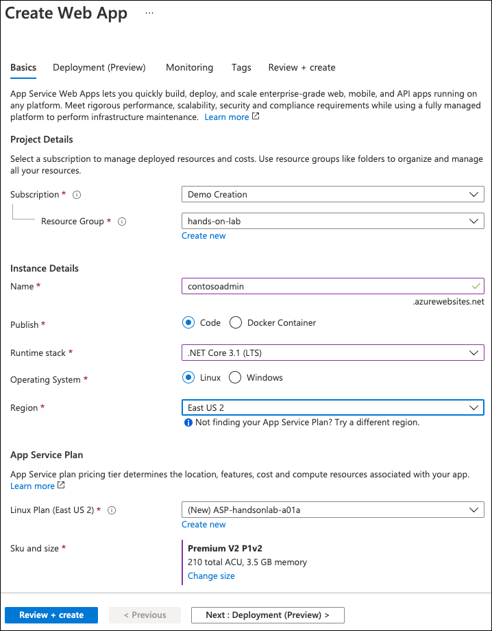

6. Select **Review and create**, then **Create** to provision the web app.

### Task 2: Update the configuration in the starter project

1. Navigate to the **App Service** blade for the Call Center Admin App just provisioned.

    

2. On the **App Service** blade, select **Configuration** in the left-hand navigation menu.

    

3. Scroll down, and locate the **Connection strings** section.

4. Add a new **Connection String** with the following values, and select **OK**:

   - **Name**: Enter `AppConfig`.
   - **Value**: Enter the Connection String for the App Configuration Store. You copied this into your text editor previously. Otherwise, you can retrieve it from the Access Keys blade of the App Configuration resource.
   - **Type**: Select **Custom**.

    

5. Select the **OK** button.

6. Select the **Save** button.

    

### Task 3: Add a managed identity and set a Key Vault access policy

The call center web application resource needs access to the Key Vault. The App Configuration will use pass-through authentication to the Key Vault. To authenticate the application, it will utilize a system managed identity.

1. From the left-hand navigation menu, select **Identity**, and on the Identity blade, change the status to **On** and select **Save** on the toolbar.

    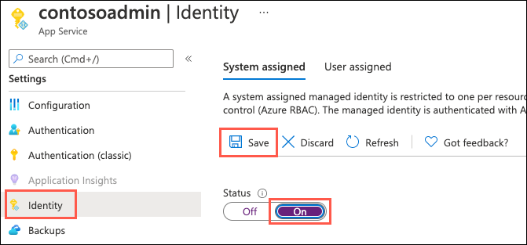

2. Return to the **hands-on-lab-SUFFIX** resource group and select the **Key vault** resource from the list.

    

3. From the left menu, select **Access policies** and then select the **Add Access Policy** link.

    

4. In the **Add access policy** form:

    - **Secret permissions**: Expand the list and check the box next to **Get**.
    - **Select principal**: Select **None selected** and in the **Select principal** dialog, search for the name of the call center application you just created and choose the managed identity.

    

5. Select **Add** on the Add access policy dialog.

6. Select **Save** on the Access policies toolbar to commit the changes.

### Task 4: Configure and deploy the call center admin Web App from Visual Studio

1. Return to Visual Studio on the LabVM and navigate to the **Contoso.Apps.SportsLeague.Admin** project located in the **Web** folder using the **Solution Explorer**.

2. Right-click the **Contoso.Apps.SportsLeague.Admin** project, and select **Manage NuGet Packages**.

3. Select the **Browse** tab, and search for **Microsoft.Azure.AppConfiguration.AspNetCore**.

4. Select **Microsoft.Azure.AppConfiguration.AspNetCore** from the search results, and in the next pane, select **Install** to install the latest stable version.

    

5. Repeat step 4-6, this time installing the latest **Azure.Identity**.

6. Now we are ready to configure this application to use the App Configuration in Azure. Under the `Contoso.Apps.SportsLeague.Admin` project, open the `Program.cs` file.

7. Uncomment the following **using** statements at the top of the file:

    ```csharp
    using Microsoft.Extensions.Configuration;
    using Azure.Identity;
    ```

8. In the **CreateHostBuilder** method, uncomment the following code - this tells the application to utilize the AppConfig connection string that you've already setup on the **contosoapp** application service to point to the centralized App Configuration resource.

    ```csharp
    webBuilder.ConfigureAppConfiguration((hostingContext, config) =>
    {
        var settings = config.Build();

        config.AddAzureAppConfiguration(options =>
        {
            options.Connect(settings["ConnectionStrings:AppConfig"])
                    .ConfigureKeyVault(kv =>
                    {
                        kv.SetCredential(new DefaultAzureCredential());
                    });
        });
    })
    .UseStartup<Startup>();
    ```

9. Right-click the `Contoso.Apps.SportsLeague.Admin` project, and select **Publish**.

    

10. On the Publish dialog, select **Azure** for the **Target**, then select **Next**.

11. For **Specific target**, select **Azure App Service (Linux)**, then select **Next**.

12. For **App Service**, expand the lab Resource group, and select the **Web App** that was created for the Call Center Admin Web App (with the name that was created previously).

    

13. Select **Finish**.

14. Select **Publish** to publish the Web application.

    

15. Once deployment is complete, navigate to the Web App. It should look like the following:

    

    > **Note**: If you see a page that indicates the app service is running and asking about deploying code, refresh the browser window by selecting CTRL+F5.

## Exercise 5: Deploy the payment gateway

**Duration**: 10 minutes

In this exercise, the attendee will provision an Azure API app template using the Microsoft Azure Portal. The attendee will then deploy the payment gateway API to the API app.

### Task 1: Provision the payment gateway API App

1. In the [Azure portal](https://portal.azure.com), select **Resource groups** from the Azure services list.

   

2. Select the **hands-on-lab-SUFFIX** resource group from the list.

   

3. On the Resource group blade, select **Add** on the toolbar.

    

4. On the create a resource blade, enter "API App" into the search box and select **API App** in the search results and then select **Create**.

5. On the new **API App** create form, create the following values:

   - **App name:** Specify a unique name for the App Name.
   - **Subscription:** Your Azure subscription.
   - **Resource Group:** Select the lab resource group.
   - **App Service Plan/Location:** Select the **contoso-asp-UNIQUEID** plan.
   - **Application Insights:** Enter the configuration, and select **Disabled**

    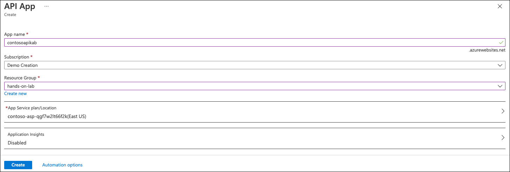

6. Select **Create**.

### Task 2: Deploy the Payment Gateway from Visual Studio

1. In Visual Studio, navigate to the **Contoso.Apps.PaymentGateway** project located in the **APIs** folder using the **Solution Explorer**.

2. Right-click the **Contoso.Apps.PaymentGateway** project, and select **Publish**.

    

3. On the Publish dialog, select **Azure** as the **Target**, then select **Next**.

4. For **Specific target**, select **Azure App Service (Windows)**, then select **Next**.

5. For **App Service**, expand the resource group, and select the API app service that you created for the payment gateway from the list, then choose **Next**.

    

6. In the **API Management** form, check the **Skip this step** checkbox. Select **Finish**.

7. Select **Publish** to publish the API App.

    

8. In the Visual Studio **Output** view, you will see a status indicating the Web App was published successfully.

    

9. Copy and paste the gateway **URL** of the deployed **API App** into Notepad for later use.

10. Viewing the Web App in a browser will display the Swagger UI for the API.

   

  > **Note**: When opening the Swagger UI using the Internet Explorer browser you will see a "Resolver error" error message. This is a result of the Swagger UI no longer supporting Internet Explorer. Copy the URL and try opening the page in Microsoft Edge, which has been installed on the LabVM. The Swagger UI will work as expected.

## Exercise 6: Deploy the Offers Web API

**Duration**: 10 minutes

In this exercise, the attendee will provision an Azure API app template using the Microsoft Azure Portal. The attendee will then deploy the Offers Web API.

### Task 1: Provision the Offers Web API App

1. In the [Azure portal](https://portal.azure.com), select **Resource groups** from the Azure services list.

   

2. Select the **hands-on-lab-SUFFIX** resource group from the list.

   

3. On the Resource group blade, select **Add** on the toolbar.

    

4. On the create a resource blade, enter "API App" into the search box and select **API App** in the search results and then select **Create**.

5. On the new **API App** create form, create the following values:

   - **App name:** Specify a unique name, such as `contoso-offers-api-SUFFIX`.
   - **Subscription:** Your Azure subscription.
   - **Resource Group:** Select the lab resource group.
   - **App Service Plan/Location:** Select the **contoso-asp-UNIQUEID** plan.
   - **Application Insights:** Enter the configuration, and select **Disabled**

    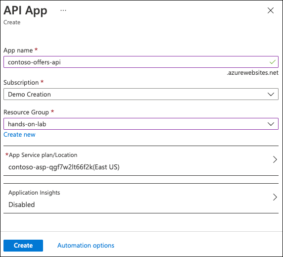

6. Select **Create**.

7. When the API App has completed provisioning, return to the resource group, then select the new API App from the list of resources.

### Task 2: Configure Cross-Origin Resource Sharing (CORS)

1. On the **App Service** blade for the Offers API, under the **API** menu section, scroll down and select **CORS**.

    

2. In the **Allowed Origins** text box, specify `*` to allow all origins, and select **Save**.

    >**Note**: You should not normally do this in a production environment. In production, you should enter the specific domains as allowed origins you need to allow CORS access to the API. The wildcard (*) is used for this lab to make it easier just for this lab.

    

### Task 3: Update the configuration in the starter project

1. On the **App Service** blade for the Offers API, select **Configuration**.

    

2. Scroll down, and locate the **Connection strings** section.

3. Add a new **Connection String** with the following values, and select **OK**:

   - **Name**: Enter `AppConfig`.
   - **Value**: Enter the Connection String for the App Configuration Store. You copied this into your text editor previously. Otherwise, you can retrieve it from the Access Keys blade of the App Configuration resource.
   - **Type**: Select **Custom**.

    

4. Select the **OK** button.

5. Select the **Save** button.

    

### Task 4: Add a managed identity and set a Key Vault access policy

The offers api resource needs access to the Key Vault. The App Configuration will use pass-through authentication to the Key Vault. To authenticate the application, it will utilize a system managed identity.

1. From the left-hand navigation menu, select **Identity**, and on the Identity blade, change the status to **On** and select **Save** on the toolbar.

    

2. Return to the **hands-on-lab-SUFFIX** resource group and select the **Key vault** resource from the list.

    

3. From the left menu, select **Access policies** and then select the **Add Access Policy** link.

    

4. In the **Add access policy** form:

    - **Secret permissions**: Expand the list and check the box next to **Get**.
    - **Select principal**: Select **None selected** and in the **Select principal** dialog, search for the name of the call center application you just created and choose the managed identity.

    

5. Select **Add** on the Add access policy dialog.

6. Select **Save** on the Access policies toolbar to commit the changes.

### Task 5: Deploy the Offers app from Visual Studio

1. Navigate to the **Contoso.Apps.SportsLeague.Offers** project located in the **APIs** folder using the **Solution Explorer** in Visual Studio.

2. Right-click the **Contoso.Apps.SportsLeague.Offers** project, and select **Manage NuGet Packages**.

3. Select the **Browse** tab, and search for **Microsoft.Azure.AppConfiguration.AspNetCore**.

4. Select **Microsoft.Azure.AppConfiguration.AspNetCore** from the search results, and in the next pane, select **Install** to install the latest stable version.

    

5. Repeat step 4-6, this time installing the latest **Azure.Identity**.

6. Now we are ready to configure this application to use the App Configuration in Azure. Under the **Contoso.Apps.SportsLeague.Offers** project, open the `Program.cs` file.

7. Uncomment the following **using** statements at the top of the file:

    ```csharp
    using Microsoft.Extensions.Configuration;
    using Azure.Identity;
    ```

8. In the **CreateHostBuilder** method, uncomment the following code - this tells the application to utilize the AppConfig connection string that you've already setup on the API application service to point to the centralized App Configuration resource.

    ```csharp
    webBuilder.ConfigureAppConfiguration((hostingContext, config) =>
    {
        var settings = config.Build();

        config.AddAzureAppConfiguration(options =>
        {
            options.Connect(settings["ConnectionStrings:AppConfig"])
                    .ConfigureKeyVault(kv =>
                    {
                        kv.SetCredential(new DefaultAzureCredential());
                    });
        });
    })
    .UseStartup<Startup>();
    ```

9. Right-click the **Contoso.Apps.SportsLeague.Offers** project, and select **Publish**.

    

10. On the Publish dialog, select **Azure** for the **Target**. Select **Next**.

11. For **Specific target**, select **Azure App Service (Windows)**. Select **Next**.

12. For **App Service**, expand the resource group, and select the API app service that you created for the Offer API from the list, then choose **Next**.

    

13. For **API Management**, check the **Skip this step** checkbox and select **Finish**.

14. Select **Publish** to publish the API App.

    

15. In the Visual Studio **Output** view, you will see a status indicating the Web App was published successfully.

    

16. Copy and paste the offer api **URL** of the deployed **API App** into Notepad for later use.

17. Viewing the Web App in a browser will display the Swagger UI for the API.

18. In the Visual Studio **Output** view, you will see a status the API app was published successfully.

19. Record the value of the deployed API app URL into Notepad for later use.

20. Viewing the Web App in a browser will display the Swagger UI for the API.

    

    > **Note**: When opening the Swagger UI using the Internet Explorer browser you will see a "Resolver error" error message. This is a result of the Swagger UI no longer supporting Internet Explorer. In another browser, the Swagger UI will work as expected.

21. Within the Swagger UI for the Offers API, select the `/api/get` method on the API. Then select the **Try it out** button, and then **Execute** to test out the API call from within the Swagger UI in the web browser. Once it executes, scroll down to view the results of the API call execution.

    

## Exercise 7: Add API endpoint configuration settings

**Duration**: 15 minutes

### Task 1: Add the API endpoint configuration settings

1. Return to the **hands-on-lab-SUFFIX** resource group and select the **App Configuration** resource from the list.

    

2. Select **Configuration explorer** from the left-hand navigation menu and then select **Create** and **Key Vault reference**.

    

3. Expand the **Create** button, and select **Key-value**. This API endpoint does not contain any secret values, thus is not required to be stored as a Key Vault value.

    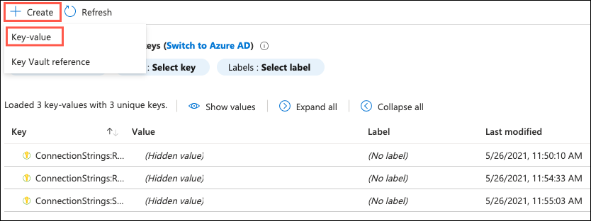

4. Create the new key-value entry with the following values:

   - **Name**: `APIEndpoints:PaymentsAPI`
   - Value: Enter the **HTTPS** URL for the Payments API App with `/api/nvp` appended to the end. This is the value that you recorded when deploying the API. Alternatively, this value can be retrieved by opening the API resource in the Azure Portal and copying the URL value on the Overview screen.

        >**Example**: `https://contoso-payments-api.azurewebsites.net/api/nvp`

5. Create another Key-value setting with the following values:

   - App Setting Name: `APIEndpoints:OffersAPI`

   - Value: Enter the **HTTPS** URL for the Offers API App with `/api/get` appended to the end. This is the value that you recorded when deploying the API. Alternatively, this value can be retrieved by opening the API resource in the Azure Portal and copying the URL value on the Overview screen.

    >**Example**: `https://contoso-offers-api.azurewebsites.net/api/get`

    >**Note**: Ensure both API URLs are using **SSL** (https://), or you will see a CORS errors.

    

### Task 2: Validate App Settings are correct

1. Return to the **hands-on-lab-SUFFIX** resource group and select the **contosoapp** App Service resource.

   

2. On the **App Service** blade, select the **URL** of the Web App displayed in the Essentials area to open it in a new browser tab.

    

3. On the homepage, you should see the latest offers populated from the Offers API.

    

    > **Note**: The page may be cached, if Today's Offers are not displayed, you can try re-publishing the e-commerce app service from Visual Studio (Contoso.Apps.SportsLeague.Web).

4. Submit several test orders to ensure all pieces of the site are functional. **Accept the default data during the payment processing.**

    

> **Note**: If you are still experiencing CORS errors, ensure the URLs to the Web App in Azure local host are exact.

## Exercise 8: Identity and Security

Duration: 75 Minutes

The Contoso call center admin application will only be accessible by users of the Contoso Active Directory environment. You have been asked to create a new Azure AD Tenant and secure the application so only users from the tenant can log on.

### Task 1: Enable Azure AD Premium Trial

>**Note**: This task is **optional**, and it is valid only if you are a global administrator on the Azure AD tenant associated with your subscription.

1. Navigate to the home page of the [Azure portal](http://portal.azure.com/) and select **Azure Active Directory**. under Azure Services.

    > **Note**: If you do not see Azure Active Directory, select More Services and then select it there.

    

2. On the **Azure Active Directory** blade, locate and select the **Company branding** option in the left-hand navigation menu.

    

3. In the right pane, select the **Get Free Premium Trial** button.

    

    If you already have a Premium Azure Active Directory, skip to Task 2.

4. On the **Activate** blade, expand **Free trial** under **Azure AD Premium P2**, then select **Activate**.

    

5. Close the **Azure Active Directory** blades.

### Task 2: Create a new Contoso user

> **Note**: This task is **optional**, and it is valid only if you are a global administrator on the Azure AD tenant associated with your subscription.

1. On the **Azure Active Directory** blade, select **Custom domain names**.

    

2. Copy the **Domain Name** for your Azure AD Tenant. It will be in the format: *[your tenant].onmicrosoft.com*.
    This will be used for creating the new user's Username.

    

3. On the **Azure Active Directory** blade, select **Users**.

    

4. Select **New user** to add a new user.

    

5. On the **User** blade, enter the following:

    **Identity**:

    - **User name**: Enter a username and select the domain name for your Azure AD Tenant. For example: *tbaker@[your tenant].onmicrosoft.com*.
    - **Name**: Enter the name of the user.
    - **Password**: Select **Auto-generate** and then check **Show password**. Copy this value into a text editor for later user.

    

6. Select **Create**.

### Task 3: Configure access control for the call center administration Web Application

> **Note**: This task is **optional**, and it is valid only if you have the right to create applications in your Azure AD Tenant.

1. Return to the **hands-on-lab-SUFFIX** resource group and select the **Call Center Administration web app** App Service resource.

   

2. On the **App Service** blade, select the **Authentication** from the left-hand navigation menu and then select **Add Identity Provider**.

    

3. On the **Add an identity provider** dialog, enter the following:

    - **Identity provider**: Select **Microsoft**.
    - **App registration type**: Choose **Create new app registration**.
    - **Name**: Accept the default value entered into this box.
    - **Supported account types**: Choose **Current tenant - Single tenant**.
    - **Authentication**: Choose **Require authentication**.
    - **Unauthenticated requests**: Choose **HTTP 302 Found redirect: recommended for web sites**.
    - **Token store**: Check this box.

    

4. Select **Add**.

5. Launch a new **InPrivate or Incognito mode** browser window and navigate to the **Call Center Administration** website. You can find the URL in the Essentials area of the web app's blade in the Azure portal.

6. The browser will redirect to the non-branded Access Control logon URL. You can log on with your Microsoft account or the **Contoso test user** you created earlier.

    

7. On the **Permissions requested** page, select **Accept**.

    

8. After you log on and **accept the consent**, your browser will be redirected to the Contoso Sports League Admin webpage.

    

### Task 4: Apply custom branding for the Azure Active Directory logon page

> **Note**: this task is **optional**, and it is valid only if you are a global administrator on the Azure AD tenant associated with your subscription, and you completed the Enabling Azure AD Premium exercise.

1. Navigate to the home page of the [Azure portal](http://portal.azure.com/) and select **Azure Active Directory**. under Azure Services.

    > **Note**: If you do not see Azure Active Directory, select More Services and then select it there.

    

2. On the **Azure Active Directory** blade, locate and select the **Company branding** option in the left-hand navigation menu.

    

3. Select the **Configure...** information box.

    

4. On the **Configure company branding** blade, select the `default_signin_illustration.jpg` image file from `C:\MCW` for the **Sign-in page image**.

    

5. Select the `logo-60-280.png` image file from the supplementary files for the **Banner image**.

    

6. Select **Save**.

    

### Task 5: Verify the branding has been successfully applied to the Azure Active Directory logon page

1. Close any previously authenticated browser sessions to the call center administration website, reopen using InPrivate or Incognito mode, and navigate to the **call center administration** website.

2. The browser will redirect to the branded access control logon URL.

    

3. After you log on, your browser will be redirected to the Contoso Sports League Admin webpage.

    

    >**Note**: If you run the app using localhost, ensure connection strings within all the appsettings.json files in the solution have the placeholders removed with actual values. Search on appsettings.json in the Visual Studio Solution Explorer to come up with the list.

## Exercise 9: Enable Azure B2C for customer site

Duration: 75 minutes

In this exercise, you will configure an Azure AD Business to Consumer (B2C) instance to enable authentication and policies for sign-in, sign-out and profile policies for the Contoso E-Commerce site.

### Task 1: Create a new directory

1. Navigate to the [Azure portal](https://portal.azure.com/) and in the left-hand navigation menu, select **+Create a resource**. Then, search for and select **Azure Active Directory B2C** and select **Create** on the new blade that pops up.

    

2. On the **Create a tenant** blade's **Configuration** tab, enter the following:

    **Directory details**:

    - **Organization name**: Enter `ContosoB2C`.
    - **Initial domain name**: Enter `contososportsorgSUFFIX`, where suffix is a unique identifier, such as `24601`, to ensure the domain name is globally unique.
    - **Country/Region**: Select the region most appropriate for your location.

    **Subscription**:

    - **Subscription**: Select the subscription you are using for this hand-on lab.
    - **Resource group**: Select the **ContosoSports** resource group.

    

3. Select **Review + create**, then **Create** on the review + create tab.

4. After directory creation completes, select the link in the new information tile that reads **Click here to navigate to your new directory**.

    

5. The new Azure AD Directory that was created will now be open in new browser tab.

### Task 2: Add a new application

1. In the **Azure AD B2C** browser tab, select **App registrations** under the **MANAGE** menu area and then select **New registration**.

    

2. Specify the following configuration options for the new Application registration:

    - **Name**: Enter `Contoso B2C Application`.
    - **Supported account types**: Choose **Accounts in any identity provider or organizational directory (for authenticating users with user flows)**.
    - **Redirect URI**: Select **Web** and then enter the URL using the format, `https://[your-web-app-name].azurewebsites.net/signin-oidc-b2c`, replacing `[your-web-app-name] with the name of the App Service hosting the Contoso E-Commerce Site.
    - **Permissions**: Leave the **Grant admin consent to openid and offline_access permissions** checkbox checked.

        

3. Select **Register**.

4. Once App registration has completed, copy the **Application (client) ID** of your new application to Notepad to use later. Keep this tab open for the next task.

     

5. Next, select **Authentication** from the left-hand navigation menu of the **Contoso B2C Application** page.

    

6. On the **Authentication** blade, scroll down and locate the **Implicit grant and hybrid flows** section. Within that section, check the **Access tokens** and **ID tokens** boxes and then select **Save** in the toolbar at the top of the blade.

    

### Task 3: Create Policies, Sign up and sign in

1. Navigate back to the **Azure AD B2C** screen.

2. To enable sign-up on your application, you will need to create a sign-up policy. This policy describes the experiences consumers will go through during sign-up and the contents of tokens the application will receive on successful sign-ups. Select **User flows** link on the left menu and then **New user flow** link at the top of the blade.

    

3. Select the **Sign up and sign in** tile, then under Version, select **Recommended**, then select the **Create** button.
  
    

4. On the **Create** screen, enter the following:

    **Name**:

    - **B2C_1_**: Enter `SignUp`.
  
    **Identity providers**:

    - **Local accounts**: Select **Email signup**.

    **Multifactor authentication**:

    - **Type of method**: Leave **Email** selected.
    - **MFA enforcement**: Choose **Conditional**. This will disable MFA for this exercise.

    **Conditional access**:

    - **Enforce conditional access policies**: Ensure this box is **unchecked**.

    **User attributes and token claims**:

    - Select **Show more...** and on the **User attributes and token claims** dialog, set the following and then select **OK**:

    | Attribute name                 | Collect Attribute | Return claim |
    | ------------------------------ | ----------------- | ------------ |
    | City                           | Unchecked         | Unchecked    |
    | Country/Region                 | **Checked**       | Unchecked    |
    | Display Name                   | **Checked**       | **Checked**  |
    | Email Address                  | Unchecked         | Unchecked    |
    | Given Name                     | Unchecked         | Unchecked    |
    | Identify Provider              | Unchecked         | **Checked**  |
    | Identify Provider Access Token | Unchecked         | Unchecked    |
    | Job Title                      | Unchecked         | Unchecked    |
    | Legal Age Group Classification | Unchecked         | Unchecked    |
    | Postal Code                    | **Checked**       | **Checked**  |
    | State/Province                 | Unchecked         | Unchecked    |
    | Street Address                 | Unchecked         | Unchecked    |
    | Surname                        | Unchecked         | Unchecked    |
    | User is new                    | Unchecked         | **Checked**  |
    | User's Object ID               | Unchecked         | **Checked**  |

    

5. Select **Create**. The sign-in/sign-up policy appears as **B2C_1_SignUp** (the **B2C_1_** fragment is automatically added) in the **User flows** blade.

    > **Note**: The page may take a few minutes to load/refresh after you start creating the policy.

    

6. Open the policy by selecting **B2C_1_SignUp**.

7. Select **Run user flow** and open the dialog.

    

8. Select **Run user flow** on the **Run user flow** dialog.

    

9. In the browser window that opens, select **Sign up now**.

    

10. On the sign up dialog, enter your email address and select **Send verification code**.

    > **Important**: You must enter a valid email address that you have access to for this lab.

    

11. Check your email for a message from **Microsoft on behalf of ContosoB2C** and copy the code provided.

    

12. Return to the **Sign Up** browser window and enter the code into the provided field, then select **Verify code**.

    

13. Enter a password and complete the remaining fields on the form and then select **Create**.

    

14. After you select **Create**, you will get a 404 error page which should look something like the below screenshot. This happens because the Contoso web app has not yet been configured to use Azure AD B2C. You will do this below, so **the error can be ignored**.

    

### Task 4: Create a profile editing policy

To enable profile editing on your application, you will need to create a profile editing policy. This policy describes the experiences that consumers will go through during profile editing and the contents of tokens that the application will receive on successful completion.

1. On the **User flows** blade, select **New user flow** again on the toolbar.

2. For the **Select a user flow type**, select the **Profile editing** tile, then select **Recommended**, and then select **Create**.

    

3. On the **Create** screen, enter the following:

    **Name**:

    - **B2C_1_**: Enter `EditProfile`.
  
    **Identity providers**:

    - **Local accounts**: Select **Email signin**.

    **Multifactor authentication**:

    - **Type of method**: Leave **Email** selected.
    - **MFA enforcement**: Choose **Conditional**. This will disable MFA for this exercise.

    **Conditional access**:

    - **Enforce conditional access policies**: Ensure this box is **unchecked**.

    **User attributes and token claims**:

    - Select **Show more...** and on the **User attributes and token claims** dialog, set the following and then select **OK**:

    | Attribute name                 | Collect Attribute | Return claim |
    | ------------------------------ | ----------------- | ------------ |
    | City                           | Unchecked         | Unchecked    |
    | Country/Region                 | **Checked**       | Unchecked    |
    | Display Name                   | **Checked**       | **Checked**  |
    | Email Address                  | Unchecked         | Unchecked    |
    | Given Name                     | Unchecked         | Unchecked    |
    | Identify Provider              | Unchecked         | Unchecked    |
    | Identify Provider Access Token | Unchecked         | Unchecked    |
    | Job Title                      | **Checked**       | Unchecked    |
    | Legal Age Group Classification | Unchecked         | Unchecked    |
    | Postal Code                    | **Checked**       | **Checked**  |
    | State/Province                 | **Checked**       | Unchecked    |
    | Street Address                 | **Checked**       | Unchecked    |
    | Surname                        | Unchecked         | Unchecked    |
    | User's Object ID               | Unchecked         | Unchecked    |

    

4. Select **Create**. The edit profile policy appears as **B2C_1_EditProfile** in the **User flows** blade.

5. Optionally, you can run the edit profile user flow by selecting the **B2C_1_EditProfile** flow and then selecting **Run user flow**.

6. Select **Run user flow** and in the new browser window, sign in with the email address and password you used to sign up for an account, and then you can edit your profile details.

    > **Important**: As with the sign-up user flow, you will get an error after saving any profile updates, as the Contoso Sports web app has not yet been updated to use Azure AD B2C.

### Task 5: Create a password reset policy

To enable profile editing on your application, you will need to create a profile password reset. This policy describes the experiences that consumers will go through during password reset and the contents of tokens that the application will receive on successful completion.

1. On the **User flows** blade, select **New user flow** again on the toolbar.

2. For the **Select a user flow type**, select the **Password reset** tile, then select **Recommended**, and then select **Create**.

    

3. On the **Create** screen, enter the following:

    **Name**:

    - **B2C_1_**: Enter `PasswordReset`.
  
    **Identity providers**:

    - **Local accounts**: Select **Reset password using email address**.

    **Multifactor authentication**:

    - **Type of method**: Leave **Email** selected.
    - **MFA enforcement**: Choose **Conditional**. This will disable MFA for this exercise.

    **Conditional access**:

    - **Enforce conditional access policies**: Ensure this box is **unchecked**.

    **User attributes and token claims**:

    - Select **Show more...** and on the **User attributes and token claims** dialog, set the following and then select **OK**:

    | Attribute name                 | Return claim |
    | ------------------------------ | ------------ |
    | City                           | Unchecked    |
    | Country/Region                 | Unchecked    |
    | Display Name                   | Unchecked    |
    | Email Address                  | **Checked**  |
    | Given Name                     | **Checked**  |
    | Job Title                      | Unchecked    |
    | Legal Age Group Classification | Unchecked    |
    | Postal Code                    | Unchecked    |
    | State/Province                 | Unchecked    |
    | Street Address                 | Unchecked    |
    | Surname                        | Unchecked    |
    | User's Object ID               | Unchecked    |

    

4. Select **Create**. The edit profile policy appears as **B2C_1_PasswordReset** in the **User flows** blade.

5. Optionally, you can run the password reset user flow by selecting the **B2C_1_PasswordReset** flow and then selecting **Run user flow**.

6. Select **Run user flow** and in the new browser window, enter the email address you used to sign up for an account, select **Send verification code** and then follow the remaining steps to reset your password.

    > **Important**: As with the sign-up user flow, you will get an error after saving any profile updates, as the Contoso Sports web app has not yet been updated to use Azure AD B2C.

### Task 6: Modify the Contoso.App.SportsLeague.Web

1. In Visual Studio, expand the **Contoso.Apps.SportsLeague.Web** project within the Solution Explorer. then locate and open the `Startup.cs` code file.

2. Add the following `using` directives to the top of the `Startup.cs` code file:

    ```csharp
    using Microsoft.AspNetCore.Authentication;
    using Microsoft.AspNetCore.Authentication.AzureADB2C.UI;
    ```

3. Locate the `public void ConfigureServices` method declaration and add the following line of code to the bottom of this method:

    ```csharp
    services.AddAuthentication(Microsoft.AspNetCore.Authentication.AzureADB2C.UI.AzureADB2CDefaults.AuthenticationScheme)
                .AddAzureADB2C(options => Configuration.Bind("AzureADB2C", options));
    ```

    

4. Locate the `app.UseAuthorization();` line within the `public void Configure` method, and add the following line of code before it:

    ```csharp
    app.UseAuthentication();
    ```

    The result will look similar to the following:

    

5. Select **Save** on the toolbar to save the `Startup.cs` file.

### Task 7: Send authentication requests to Azure AD

Your app is now configured to communicate with Azure AD B2C by using ASP.NET Core Identity. OWIN has taken care of all of the details of crafting authentication messages, validating tokens from Azure AD, and maintaining user session. All that remains is to initiate each user's flow.

1. Right select the **Controllers** folder, and select **Add** -> **Controller**.

    

2. Select **MVC Controller - Empty** and then select **Add**. Replace default name of **HomeController1.cs** with the name of **AccountController.cs** for the new Controller being added.

    

3. Add the following using statements to the top of the controller, below the existing using statements:

    ```csharp
    using Microsoft.AspNetCore.Authentication;
    using Microsoft.AspNetCore.Authentication.AzureADB2C.UI;
    using Microsoft.Extensions.Configuration;
    ```

4. Locate the default controller **Index** method.

    

5. Replace the method with the following code:

    ```csharp
    private string _editProfilePolicyId;

    public AccountController(IConfiguration configuration)
    {
        _editProfilePolicyId = configuration.GetValue<string>("AzureADB2C:EditProfilePolicyId");
    }

    public ActionResult SignIn()
    {
        if (!User.Identity.IsAuthenticated)
        {
            return Challenge(new AuthenticationProperties() { RedirectUri = "/" }, AzureADB2CDefaults.AuthenticationScheme);
        }
        return RedirectToAction("Index", "Home");
    }

    public ActionResult SignUp()
    {
        if (!User.Identity.IsAuthenticated)
        {
            return Challenge(new AuthenticationProperties() { RedirectUri = "/" }, AzureADB2CDefaults.AuthenticationScheme);
        }
        return RedirectToAction("Index", "Home");
    }

    public ActionResult Profile()
    {
        if (User.Identity.IsAuthenticated)
        {
                var properties = new AuthenticationProperties() { RedirectUri = "/" };
                properties.Items[AzureADB2CDefaults.PolicyKey] = _editProfilePolicyId;
                return Challenge(
                    properties,
                    AzureADB2CDefaults.AuthenticationScheme);
        }
        return RedirectToAction("Index", "Home");
    }

    public ActionResult SignOut()
    {
        if (!User.Identity.IsAuthenticated)
        {
            return RedirectToAction("Index", "Home");
        }
        string redirectUri = Url.Action("Index", "Home", null, Request.Scheme);
        var properties = new AuthenticationProperties
        {
            RedirectUri = redirectUri
        };
        return SignOut(properties, AzureADB2CDefaults.CookieScheme, AzureADB2CDefaults.OpenIdScheme);
    }
    ```

6. Save the file by selecting **Save** on the Visual Studio toolbar.

### Task 8: Display user information

When you authenticate users by using OpenID Connect, Azure AD returns an ID token to the app that contains **claims**. These are assertions about the user. You can use claims to personalize your app. You can access user claims in your controllers via the ClaimsPrincipal.Current security principal object.

1. Open the **Controllers\\HomeController.cs** file and add the following using statements at the end of the other using statements at the top of the file, below the existing using statements:

    ```csharp
    using Microsoft.AspNetCore.Authorization;
    ```

2. Next, add the following method to the **HomeController** class:

    ```csharp
    [Authorize]
    public ActionResult Claims()
    {
        var displayName = User.Identity.Name;
        ViewBag.DisplayName = displayName;
        ViewBag.Claims = User.Claims;
        return View();
    }
    ```

3. To access the claims that your application receives, you will create a new claims view that will display a list of all the claims the app receives. In the Visual Studio Solution Explorer, expand the **Views -\> Home** folder under the **Contoso.Apps.SportsLeague.Web** project, right-click the **Home** folder, and then select **Add -\> View**.

    

4. On the **Add New Scaffolded Item** dialog, select **Razor View - Empty** and select **Add**.

    

5. On the **Add New Item** dialog, enter **Claims.cshtml** as the name of the new view and then select **Add**.

    

6. In the new **Claims.cshtml** file that opens in Visual Studio, replace all the file's contents with the following code:

    ```csharp
    @using System.Security.Claims
    @{
        ViewBag.Title = "Claims";
    }
    <h2>@ViewBag.Title</h2>

    <h4>Claims Present in the Claims Identity: @ViewBag.DisplayName</h4>

    <table class="table-hover claim-table">
        <tr>
            <th class="claim-type claim-data claim-head">Claim Type</th>
            <th class="claim-data claim-head">Claim Value</th>
        </tr>

        @foreach (Claim claim in ViewBag.Claims)
        {
            <tr>
                <td class="claim-type claim-data">@claim.Type</td>
                <td class="claim-data">@claim.Value</td>
            </tr>
        }
    </table>
    ```

7. Select **Save** on the toolbar in Visual Studio to save the `Claims.cshtml` file.

8. Next, you will create a partial view to handle logging users in and out under the **Shared** folder. Right-click on the **Views -\> Shared** folder, select **Add**, add a new **View**.

9. On the **Add New Scaffolded Item** dialog, select **Razor View - Empty** and select **Add**.

10. On the **Add New Item** dialog, enter **\_LoginPartial.cshtml** for the name (making sure to include the leading underscore, "_", in the file name) and then select **Add**.

11. Replace all contents of the file with the following code to create a razor partial view to provide a sign-in and sign-out link as well as a link to edit the user's profile:

    ```html
    @if (User.Identity.IsAuthenticated)
    {
        <text>
            <ul class="nav navbar-nav navbar-right">
                <li>
                    <a id="profile-link">@User.Identity.Name</a>
                    <div id="profile-options" class="nav navbar-nav navbar-right">
                        <ul class="profile-links">
                            <li class="profile-link">
                                @Html.ActionLink("Edit Profile", "Profile", "Account")
                            </li>
                        </ul>
                    </div>
                </li>
                <li>
                    @Html.ActionLink("Sign out", "SignOut", "Account")
                </li>
            </ul>
        </text>
    }
    else
    {
        <ul class="nav navbar-nav navbar-right">
            <li>@Html.ActionLink("Sign up", "SignUp", "Account", routeValues: null, htmlAttributes: new { id = "signUpLink" })</li>
            <li>@Html.ActionLink("Sign in", "SignIn", "Account", routeValues: null, htmlAttributes: new { id = "loginLink" })</li>
        </ul>
    }
    ```

12. Select **Save** on the toolbar in Visual Studio to save the `_LoginPartial.cshtml` file.

13. Open `Views\Shared\_Layout.cshtml` in Visual Studio.

14. Locate the **DIV** markdown element that has the class of `header-top` (line 46 of the file), and add the line that starts with `@Html.ActionLink` and the line that starts with `@Html.Partial`.

    ```html
    <div class="header-top">
        <div class="container">
            <div class="row">
                <div class="header-top-left">
                <a href="#"><i class="fa fa-twitter"></i></a>
                <a href="#"><i class="fa fa-facebook"></i></a>
                <a href="#"><i class="fa fa-linkedin"></i></a>
                <a href="#"><i class="fa fa-instagram"></i></a>
                </div>
                <div class="header-top-right">
                    <a href="#" class="top-wrap"><span class="icon-phone">Call today: </span> (555) 555-8000</a>
                    @Html.ActionLink("Claims", "Claims", "Home")
                </div>
                @Html.Partial("_LoginPartial")
            </div>
        </div>
    </div>
    ```

### Task 9: Update App Service configuration

In this task, you update the configuration settings for the deployed web app in the Azure portal.

1. Return to the [Azure portal](https://portal.azure.com/), navigate to the **hands-on-lab-SUFFIX** resource group, and locate the Azure AD B2C resource. Copy the name portion of the **B2C tenant** and pasted it into a text edit, such as Notepad.exe.

    > **Note**: The name portion of the tenant is everything leading up to the first period (.) in the resource name. So, you will exclude `.onmicrosoft.com` from what you copy and paste into the text editor.

    

2. While still on the **hands-on-lab-SUFFIX** resource group blade in the Azure portal, select the Contoso Web App resource, and then select **Configuration** on the web app blade.

3. Add the following settings in the **Application Settings** section:

   - AzureADB2C:Instance - `https://[your-AAD-B2C-tenant-name].b2clogin.com/tfp/`
   - AzureADB2C:ClientId - **B2C Application ID you copied down earlier**.
   - AzureADB2C:CallbackPath - `/signin-oidc-b2c`
   - AzureADB2C:Domain - `[your-AAD-B2C-tenant-name]`.onmicrosoft.com**
   - AzureADB2C:SignUpSignInPolicyId - `B2C_1_SignUp`
   - AzureADB2C:ResetPasswordPolicyId - `B2C_1_PasswordReset`
   - AzureADB2C:EditProfilePolicyId - `B2C_1_EditProfile`

4. Select **Save** on the toolbar.

### Task 10: Run the sample app

In this task, you re-deploy the web app to your App Service and test the app using Azure AD B2C.

1. Go back to Visual Studio, right-click on the **Contoso.Apps.SportsLeague.Web** project, and select **Publish**. Follow the steps to deploy the updated application to the Microsoft Azure Web App.

    Launch a browser outside of Visual Studio for testing if the page loads in Visual Studio.

2. Test out Sign up.

3. Next, test Sign out.

4. When you select Claims and are not signed in, it will bring you to the sign-in page and then display the claim information. Sign in, and test Edit Profile.

    

    Claims information page:

    

## Exercise 10: Enabling Telemetry with Application Insights

**Duration**: 30 Minutes

To configure the application for logging and diagnostics, you have been asked to configure Microsoft Azure Application Insights and add some custom telemetry.

### Task 1: Add Application Insights Telemetry to the e-commerce website project

1. Open the Solution **Contoso.Apps.SportsLeague** in Visual Studio.

2. Navigate to the **Contoso.Apps.SportsLeague.Web** project located in the **Web** folder using the **Solution Explorer** in Visual Studio.

3. Expand the **Contoso.Apps.SportsLeague.Web** project, then right-click on the **Dependencies** node, and select **Manage NuGet Packages...**.

4. Within the **NuGet Package Manager**, select the **Browse** tab, then search for and install the following NuGet package:

    - **Microsoft.ApplicationInsights.AspNetCore**

5. Open the file `\Helpers\TelemetryHelper.cs` located in the **Contoso.Apps.SportsLeague.Web** project.

6. Add the following using statements to the top of the file:

    ```csharp
    using Microsoft.ApplicationInsights;
    using Microsoft.ApplicationInsights.Extensibility;
    ```

7. Add the following code to the **TrackException** method to instantiate the telemetry client and track exceptions:

    ```csharp
    var client = new TelemetryClient(TelemetryConfiguration.CreateDefault());
    client.TrackException(new Microsoft.ApplicationInsights.DataContracts.ExceptionTelemetry(exc));
    ```

8. Add the following code to the **TrackEvent** method to instantiate the telemetry client and track event data:

    ```csharp
    var client = new TelemetryClient(TelemetryConfiguration.CreateDefault());
    client.TrackEvent(eventName, properties);
    ```

9. Save the `TelemetryHelper.cs` file.

### Task 2: Enable client side telemetry

1. Return to the **hands-on-lab-SUFFIX** Resource Group and select the **Application Insights** resource.

    

2. Copy the **Instrumentation Key** value in the Essentials area of the Overview blade by selecting the **Copy to clipboard** icon to the right of the key value.

    

3. Select **Getting Started** on the toolbar of the Application Insights blade.

    

4. In the portal, navigate to **How-to Guides** -> **Application Insights** -> **Code-based monitoring** -> **JavaScript** -> **Client-side JavaScript**, then navigate to the **Snippet based setup** section under **Adding the JavaScript SDK** within the documentation page.

    

    > **Note**: You can find the documentation page at the following URL: <https://docs.microsoft.com/azure/azure-monitor/app/javascript#snippet-based-setup>.

5. Select and copy the full contents of the JavaScript under the **Snippet based setup** heading.

    

    Here's the JavaScript code to copy/paste for quick reference:

    ```javascript
    <script type="text/javascript">
        !function(T,l,y){var S=T.location,u="script",k="instrumentationKey",D="ingestionendpoint",C="disableExceptionTracking",E="ai.device.",I="toLowerCase",b="crossOrigin",w="POST",e="appInsightsSDK",t=y.name||"appInsights";(y.name||T[e])&&(T[e]=t);var n=T[t]||function(d){var g=!1,f=!1,m={initialize:!0,queue:[],sv:"4",version:2,config:d};function v(e,t){var n={},a="Browser";return n[E+"id"]=a[I](),n[E+"type"]=a,n["ai.operation.name"]=S&&S.pathname||"_unknown_",n["ai.internal.sdkVersion"]="javascript:snippet_"+(m.sv||m.version),{time:function(){var e=new Date;function t(e){var t=""+e;return 1===t.length&&(t="0"+t),t}return e.getUTCFullYear()+"-"+t(1+e.getUTCMonth())+"-"+t(e.getUTCDate())+"T"+t(e.getUTCHours())+":"+t(e.getUTCMinutes())+":"+t(e.getUTCSeconds())+"."+((e.getUTCMilliseconds()/1e3).toFixed(3)+"").slice(2,5)+"Z"}(),iKey:e,name:"Microsoft.ApplicationInsights."+e.replace(/-/g,"")+"."+t,sampleRate:100,tags:n,data:{baseData:{ver:2}}}}var h=d.url||y.src;if(h){function a(e){var t,n,a,i,r,o,s,c,p,l,u;g=!0,m.queue=[],f||(f=!0,t=h,s=function(){var e={},t=d.connectionString;if(t)for(var n=t.split(";"),a=0;a<n.length;a++){var i=n[a].split("=");2===i.length&&(e[i[0][I]()]=i[1])}if(!e[D]){var r=e.endpointsuffix,o=r?e.location:null;e[D]="https://"+(o?o+".":"")+"dc."+(r||"services.visualstudio.com")}return e}(),c=s[k]||d[k]||"",p=s[D],l=p?p+"/v2/track":config.endpointUrl,(u=[]).push((n="SDK LOAD Failure: Failed to load Application Insights SDK script (See stack for details)",a=t,i=l,(o=(r=v(c,"Exception")).data).baseType="ExceptionData",o.baseData.exceptions=[{typeName:"SDKLoadFailed",message:n.replace(/\./g,"-"),hasFullStack:!1,stack:n+"\nSnippet failed to load ["+a+"] -- Telemetry is disabled\nHelp Link: https://go.microsoft.com/fwlink/?linkid=2128109\nHost: "+(S&&S.pathname||"_unknown_")+"\nEndpoint: "+i,parsedStack:[]}],r)),u.push(function(e,t,n,a){var i=v(c,"Message"),r=i.data;r.baseType="MessageData";var o=r.baseData;return o.message='AI (Internal): 99 message:"'+("SDK LOAD Failure: Failed to load Application Insights SDK script (See stack for details) ("+n+")").replace(/\"/g,"")+'"',o.properties={endpoint:a},i}(0,0,t,l)),function(e,t){if(JSON){var n=T.fetch;if(n&&!y.useXhr)n(t,{method:w,body:JSON.stringify(e),mode:"cors"});else if(XMLHttpRequest){var a=new XMLHttpRequest;a.open(w,t),a.setRequestHeader("Content-type","application/json"),a.send(JSON.stringify(e))}}}(u,l))}function i(e,t){f||setTimeout(function(){!t&&m.core||a()},500)}var e=function(){var n=l.createElement(u);n.src=h;var e=y[b];return!e&&""!==e||"undefined"==n[b]||(n[b]=e),n.onload=i,n.onerror=a,n.onreadystatechange=function(e,t){"loaded"!==n.readyState&&"complete"!==n.readyState||i(0,t)},n}();y.ld<0?l.getElementsByTagName("head")[0].appendChild(e):setTimeout(function(){l.getElementsByTagName(u)[0].parentNode.appendChild(e)},y.ld||0)}try{m.cookie=l.cookie}catch(p){}function t(e){for(;e.length;)!function(t){m[t]=function(){var e=arguments;g||m.queue.push(function(){m[t].apply(m,e)})}}(e.pop())}var n="track",r="TrackPage",o="TrackEvent";t([n+"Event",n+"PageView",n+"Exception",n+"Trace",n+"DependencyData",n+"Metric",n+"PageViewPerformance","start"+r,"stop"+r,"start"+o,"stop"+o,"addTelemetryInitializer","setAuthenticatedUserContext","clearAuthenticatedUserContext","flush"]),m.SeverityLevel={Verbose:0,Information:1,Warning:2,Error:3,Critical:4};var s=(d.extensionConfig||{}).ApplicationInsightsAnalytics||{};if(!0!==d[C]&&!0!==s[C]){method="onerror",t(["_"+method]);var c=T[method];T[method]=function(e,t,n,a,i){var r=c&&c(e,t,n,a,i);return!0!==r&&m["_"+method]({message:e,url:t,lineNumber:n,columnNumber:a,error:i}),r},d.autoExceptionInstrumented=!0}return m}(y.cfg);(T[t]=n).queue&&0===n.queue.length&&n.trackPageView({})}(window,document,{
        src: "https://az416426.vo.msecnd.net/scripts/b/ai.2.min.js", // The SDK URL Source
        //name: "appInsights", // Global SDK Instance name defaults to "appInsights" when not supplied
        //ld: 0, // Defines the load delay (in ms) before attempting to load the sdk. -1 = block page load and add to head. (default) = 0ms load after timeout,
        //useXhr: 1, // Use XHR instead of fetch to report failures (if available),
        //crossOrigin: "anonymous", // When supplied this will add the provided value as the cross origin attribute on the script tag 
        cfg: { // Application Insights Configuration
            instrumentationKey: "YOUR_INSTRUMENTATION_KEY_GOES_HERE"
            /* ...Other Configuration Options... */
        }});
    </script>
    ```

    > **Note**: Make sure to replace the `YOUR_INSTRUMENTATION_KEY_GOES_HERE` placeholder with the Application Insights Instrumentation Key.

6. Navigate to the **Contoso.Apps.SportsLeague.Web** project located in the **Web** folder using the **Solution Explorer** in Visual Studio.

7. Open **Views \> Shared \> \_Layout.cshtml**.

    

8. Paste in the code before the `</head>` tag. Insert your **Instrumentation Key** from Notepad into the JavaScript code ``instrumentationKey:`` value.

    

9. Save the `_Layout.cshtml` file.

### Task 3: Deploy the e-commerce Web App from Visual Studio

1. Navigate to the **Contoso.Apps.SportsLeague.Web** project located in the **Web** folder using the **Solution Explorer** in Visual Studio.

2. Right-click on the **Contoso.Apps.SportsLeague.Web** project, and select **Publish**.

    

3. Select **Publish** again when the Publish dialog appears.

4. Launch a browser **outside of Visual Studio** for testing if the page is loaded in Visual Studio.

5. Select a few links on the published E-Commerce website, and submit several orders to generate some sample telemetry.

### Task 4: View the Application Insights logs

1. Return to the **hands-on-lab-SUFFIX** Resource Group and select the **Application Insights** resource.

    

2. Select **Application Dashboard**. View the performance timeline to see the overall number of requests and page load time.

    

    

3. Navigate back to the Application Insights overview for the **Application Insights** instance, then select **Performance** in the left-hand navigation menu to see individual endpoint render performance.
  
    

    

4. Under **Usage** link area, select the **Events** menu option. Select the **View More Insights** button.

    

5. Select **View More Insights**, then scroll down to see event list.

    

## Exercise 11: Automating backend processes with Azure Functions and Logic Apps

**Duration**: 45 Minutes

Contoso wants to automate the process of generating receipts in PDF format and alerting users when their orders have been processed using Azure Logic App and Functions. To run custom snippets of C\# or node.js in logic apps, you can create custom functions through Azure Functions. [Azure Functions](https://docs.microsoft.com/azure/azure-functions/functions-overview) offers server-free computing in Microsoft Azure and are useful for performing these tasks:

- Advanced formatting or compute of fields in logic apps
- Perform calculations in a workflow
- Extend the logic app functionality with functions that are supported in C\# or node.js

### Task 1: Create an Azure Function to Generate PDF Receipts

1. In the [Azure portal](https://portal.azure.com), select **Resource groups** from the Azure services list.

   

2. Select the **hands-on-lab-SUFFIX** resource group from the list.

   

3. On the Resource group blade, select **Add** on the toolbar.

    

4. On the create a resource blade, enter "Function App" into the search box and select **Function App** in the search results and then select **Create**.

5. Provision and deploy the new function app, with the following settings:

    **Project Details**:

    - **Subscription**: Select the subscription you are using for this hands-on-lab.
    - **Resource Group**: Choose the **hands-on-lab-SUFFIX** resource group.

    **Instance Details**:

    - **Function App name**: Enter a globally unique name, such as `contoso-function-app-SUFFIX`.
    - **Publish**: Select **Code**.
    - **Runtime Stack**: Select **.NET**.
    - **Version**: Select **3.1**.
    - **Region**: Choose the same region used for the e-commerce web app in this lab.

    

6. Select **Next: Hosting >** and on the **Hosting** tab, set the following:

    **Storage**:

    - **Storage account**: Select the lab storage account, prefixed with **contoso**.

    **Operating System**:

    - **Operating System**: Select **Windows**.

    **Plan**:

    - **Plan type**: Select **App service plan**.
    - **Windows Plan**: Select **ContosoSportsPlan**.
    - **Sku and size**: Select **Standard S1**.

    

7. Select **Review + create**, then **Create**.

8. Navigate to the **Function App** that was just created, and select **Configuration**.

    

9. Add a new **Application Setting** with the following values:

   - **Name**: Enter `AppConfigConnectionString`.
   - **Value**: Enter the Connection String for the App Configuration Store.
  
10. Select the **OK** button.

11. Select the **Save** button.

## Task 2: Add Key Vault access using a managed identity

The function application resource needs access to the Key Vault. The App Configuration will use pass-through authentication to the Key Vault. To authenticate the application, it will utilize a system managed identity.

1. From the left-hand navigation menu, select **Identity**, and on the Identity blade, change the status to **On** and select **Save** on the toolbar.

    

2. Return to the **hands-on-lab-SUFFIX** resource group and select the **Key vault** resource from the list.

    

3. From the left menu, select **Access policies** and then select the **Add Access Policy** link.

    

4. In the **Add access policy** form:

    - **Secret permissions**: Expand the list and check the box next to **Get**.
    - **Select principal**: Select **None selected** and in the **Select principal** dialog, search for the name of the call center application you just created and choose the managed identity.

    

5. Select **Add** on the Add access policy dialog.

6. Select **Save** on the Access policies toolbar to commit the changes.

### Task 3: Configure and deploy the Function App

1. In Visual Studio, expand the **Web** folder and right-click on the **Contoso.Apps.FunctionApp** project, and select **Manage NuGet Packages**.

2. On the **Browse** tab, search for and select **Microsoft.Extensions.Configuration.AzureAppConfiguration**. In the right pane, select **Install**.

3. Repeat step 2, this time for the package **Azure.Identity**.

4. Within the **Contoso.Apps.FunctionApp** project, locate and open the `ContosoMakePdf.cs` source file.

5. Uncomment the following **using** statements:

    ```csharp
    using Microsoft.Extensions.Configuration;
    using Azure.Identity;
    ```  

6. Inside the static class **ContosoMakePdf**, uncomment the following code that sets up a connection to the App Configuration store and the Key Vault credential pass-through:

    ```csharp
    private static IConfiguration Configuration { set; get; }

    static ContosoMakePdf()
    {
        var builder = new ConfigurationBuilder();            
        builder.AddAzureAppConfiguration(options =>
        {
            options.Connect(Environment.GetEnvironmentVariable("AppConfigConnectionString"))               
                    .ConfigureKeyVault(kv =>
                    {
                        kv.SetCredential(new DefaultAzureCredential());
                    });
        });
        Configuration = builder.Build();
    }
    ```

7. In the **ProcessOrder** method, uncomment the following line of code:

    ```csharp
    Order.ReceiptUrl = await StorageMethods.UploadPdfToBlob(receipt, fileName, Configuration, log);
    ```

8. To publish the Function App, open the Visual Studio solution, Right-click on the **Contoso.Apps.FunctionApp** project, then select **Publish**.

9. For **Target**, choose **Azure** and then select **Next**.

10. For **Specific target**, choose **Azure Function App (Windows)**, then select **Next**.

11. For **Functions instance**, expand the lab resource group and select the **Function App**, then select **Finish**.

    

12. Select **Publish**.

    > **Note**: The publish should only take a minute or so. You can check the **Output** window for any errors that may occur.

    

13. To test your newly published Function App, start by navigating back to your Contoso Function App in the Azure Portal. Select the newly created **ContosoMakePDF** function listed in the functions.

    

14. Select the **Code + Test** link, then select the **Test/Run** button.

    

15. Select **POST** for the HTTP method.

16. Open the **sample.dat** file found in the `C:\MCW\MCW-Modern-cloud-apps-master\Hands-on lab\lab-files\src\Contoso Sports League\Contoso.CreatePDFReport` directory on your LabVM. Copy the contents into the **Request body** text box.

    

17. Select the **Run** button located at the bottom of the blade.

    

    > **Note**: There is also a **Run** button located at the top of the Azure Function blade. Selecting either of these buttons will run the function just the same.

    After a few seconds, you should see logs like in the below image. You should see return status code of 200.  The **Output** text box should show recent Contoso purchase data. You should see a message stating the file has been created and stored in the blob storage.

    

18. Check your receipt PDF in the storage account blob.

    - Navigate to the ContosoSports storage account.
    - Select the **Blobs** link.

    

19. Choose the newly created **receipts** blob container.

    

20. Open **ContosoSportsLeague-Store-Receipt-XX.pdf** link.

    

21. Open the `...` link and choose download menu item.

    

### Task 4: Create an Azure Logic App to Process Orders

Without writing any code, you can automate business processes more easily and quickly when you create and run workflows with Azure Logic Apps. Logic Apps provide a way to simplify and implement scalable integrations and workflows in the cloud. It provides a visual designer to model and automate your process as a series of steps known as a workflow. There are [many connectors](https://docs.microsoft.com/azure/connectors/apis-list) across the cloud and on-premises to quickly integrate across services and protocols.

The advantages of using Logic Apps include the following:

- Saving time by designing complex processes using easy to understand design tools
- Implementing patterns and workflows seamlessly, that would otherwise be difficult to implement in code
- Getting started quickly from templates
- Customizing your logic app with your own custom APIs, code, and actions
- Connect and synchronize disparate systems across on-premises and the cloud
- Build off BizTalk server, API Management, Azure Functions, and Azure Service Bus with first-class integration support

1. Next, we will create a Logic App that will trigger when an item is added to the **receiptgenerator** queue. In the Azure Management Portal, select the **+ Create a resource** button, search for and select **Logic App**, then select **Create**.

2. Fill out the name as **ContosoLogicApplication** along with your subscription, and use the existing resource group **contososports**. Choose the **same region** that you have been using for this lab. Select **Review + create**, then **Create** once validation has passed.

    

3. Open the newly created **ContosoLogicApplication** logic app resource after it is deployed.

4. In the Logic Apps Designer, under **Templates**, select **Blank Logic App**.

    

    >**Note**: The first time you access the Logic App resource, it will automatically enter the Logic App Designer. Otherwise, you can open the logic app designer by selecting the **Logic app designer** link from the left menu of the resource screen (beneath **Development Tools**).

5. Select the **All** tab, then select **Service Bus**.

    

6. Select **Service Bus - When a message is received in a queue (auto-complete)**.

    

7. Specify **ContosoQueue** as the connection name, select the Contoso storage account from the list.

    

8. Select the **RootManageSharedAccessKey** from the list of Service Bus Policies, then select **Create**.

    

9. Select the **receiptgenerator** queue from the drop-down.

    

    >**Note**: If you wish, you can set the **Interval** and **Frequency** to check for new items to a shorter interval than the default; such as every 30 seconds. This could help reduce delay for when the Logic App is triggered when new messages are sent to the Service Bus Queue while you progress through this lab.

10. Select the **+ New step** button, choose the **All** tab, then select **Azure Functions**.

    

11. Select the **Azure Function App** you just created.

    

12. Select the Azure function **ContosoMakePDF**.

    

13. Type this in the Request Body:

    ```json
    {"Order": pick Content from list (see picture below) }
    ```

    Make sure the syntax is json format. Sometimes the ":" will go to the right side of Content by mistake. Keep it on the left. It should look like this:

    

14. Select **Save** to save the Logic App.

15. Run the logic app by selecting the **Run** button of the Logic app designer toolbar. It should process the orders you have submitted previously to test PDF generation. Using Azure Storage Explorer or Visual Studio Cloud Explorer you can navigate to the storage account and open the receipts container to see the created PDFs.

    

16. Double-click the PDF document to download and see the Purchase receipt.

17. Open the **ContosoLogicApplication** Logic Apps Designer. We will be adding another to the flow for updating the database. In the designer, select **+ New step**.

    

18. Select the **All** tab, then choose **SQL Server**.

    

19. Select **Update row (V2)**.

    

20. Enter the following values, then select **Create**:

    - Authentication Type: **SQL Server Authentication**

    - SQL server name: _Enter the DNS name of the SQL Database Failover Cluster Read/Write Listener Endpoint that was copied previously_.

    - SQL database name: `ContosoSportsDB`

    - Username: `demouser`

    - Password: `demo@pass123`

    

21. Select the **Server name** and **Database name** previously specified, then from the drop-down select the name of the **Orders** table, and enter `OrderId` into the **Row id** field.

    

22. Press **Save**, then select the **Code View** button.

23. Add the following JSON within the `Update_row_(V2).inputs` object:

    ```json
    "body": {
        "OrderDate": "@{body('ContosoMakePDF')['OrderDate']}",
        "FirstName": "@{body('ContosoMakePDF')['FirstName']}",
        "LastName": "@{body('ContosoMakePDF')['LastName']}",
        "Address": "@{body('ContosoMakePDF')['Address']}",
        "City": "@{body('ContosoMakePDF')['City']}",
        "State": "@{body('ContosoMakePDF')['State']}",
        "PostalCode": "@{body('ContosoMakePDF')['PostalCode']}",
        "Country": "@{body('ContosoMakePDF')['Country']}",
        "Phone": "@{body('ContosoMakePDF')['Phone']}",
        "SMSOptIn": "@{body('ContosoMakePDF')['SMSOptIn']}",
        "SMSStatus": "@{body('ContosoMakePDF')['SMSStatus']}",
        "Email": "@{body('ContosoMakePDF')['Email']}",
        "ReceiptUrl": "@{body('ContosoMakePDF')['ReceiptUrl']}",
        "Total": "@{body('ContosoMakePDF')['Total']}",
        "PaymentTransactionId": "@{body('ContosoMakePDF')['PaymentTransactionId']}",
        "HasBeenShipped": "@{body('ContosoMakePDF')['HasBeenShipped']}"
    },
    ```

    After this has been added, the JSON will look as follows:

    

24. And modify the `path` variable for the `Update_row_(V2)` action to include the index key or OrderId as follows:

    ```json
    "path": "/v2/datasets/@{encodeURIComponent(encodeURIComponent('default'))},@{encodeURIComponent(encodeURIComponent('default'))}/tables/@{encodeURIComponent(encodeURIComponent('[dbo].[Orders]'))}/items/@{encodeURIComponent(encodeURIComponent(body('ContosoMakePDF')['OrderId']))}"
    ```

25. **Save** and return to the designer.

26. Your updated designer view should look like this:

    

27. Select Run on the Logic App Designer, and then run the Contoso sports Web App and check out an Item.

28. Run the call center website app, and select the last Details link in the list.

    

29. You should now see a Download receipt link because the database has been updated.

    

30. Select the Download receipt link to see the receipt.

31. Return to the Logic app and you should see all green check marks for each step. If not, select the yellow status icon to find out details.

    

### Task 5: Use Twilio to send SMS Order Notifications

<!-- omit in toc -->
#### Subtask 1: Configure your Twilio trial account

1. If you do not have a Twilio account, sign up for one for free at the following URL:

    [https://www.twilio.com/try-twilio](https://www.twilio.com/try-twilio)

   

2. On the home dashboard, select **Get a Trial Number**.

   

3. Record the **Phone Number**, select the **Choose this Number** button on the **Your first Twilio Phone Number** prompt, and select **Done**.

    

4. Select **Home**, then **Settings**. Authenticate if needed and then record the **Account SID** and **Auth Token** for use when configuring the Twilio Connector.

    

<!-- omit in toc -->
#### Subtask 2: Create a new logic app

1. Open **Azure Data Studio** on the LabVM.

2. In Azure Data Studio, select **New connection** and in the connection dialog enter the details to connect to the SQL Database for the **ContosoSportsDB** database, as follows:

    - **Connection Type**: Select Microsoft SQL Server.
    - **Server**: Enter the server name of the primary **ContosoSportsDB**, which you can find in the **Server name** property within the Essentials area of the overview blade for the SQL Database.
    - **Authentication type**: Select **SQL Login**.
    - **User name**: Enter `demouser`.
    - **Password**: Enter `Password.1!!`.
    - **Remember password**: Check this box.
    - **Database**: Select **ContosoSportsDB**.

    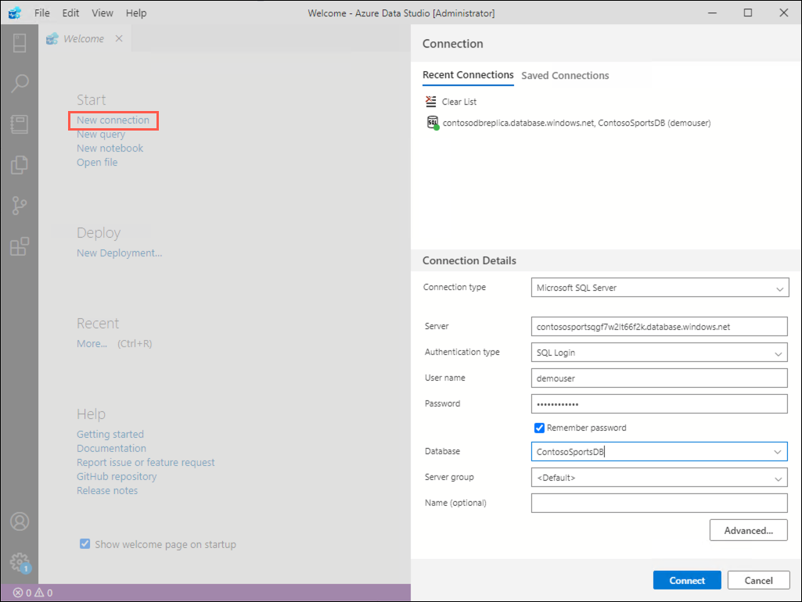

3. Select **Connect** to open the connection to the database.

4. In the open connection window, select **New Query** on the toolbar.

    

5. In the query window that opens, paste the following code:

    ```sql
    CREATE PROCEDURE [dbo].[GetUnprocessedOrders]
    AS
    declare @returnCode int 
    SELECT @returnCode = COUNT(*) FROM [dbo].[Orders] WHERE PaymentTransactionId is not null AND PaymentTransactionId <> '' AND Phone is not null AND Phone <> '' AND SMSOptIn = '1' AND SMSStatus is null
    return @returnCode

    GO
    ```

6. Select **Run** in the toolbar to execute the query.

    

7. You should receive a message in the output panel that the commands completed successfully.

    

8. Delete the SQL script for the Stored Procedure from the query editor, and replace it with the following:

    ```sql
    CREATE PROCEDURE [dbo].[ProcessOrders]
    AS
    SELECT * FROM [dbo].[Orders] WHERE PaymentTransactionId is not null AND PaymentTransactionId <> '' AND Phone is not null AND Phone <> '' AND SMSOptIn = '1' AND SMSStatus is null;

    UPDATE [dbo].[Orders] SET SMSStatus = 'sent' WHERE PaymentTransactionId is not null AND PaymentTransactionId <> '' AND Phone is not null AND Phone <> '' AND SMSOptIn = '1' AND SMSStatus is null;
    ```

9. Select **Run** in the toolbar to execute the query.

10. Return to the **hands-on-lab-SUFFIX** resource group and select the **Logic App** resource from the list of resources.

    

11. In the Logic Apps Designer, select the **Blank Logic App** Template.

    

12. On the **Logic Apps Designer**, select the **All** tab, and choose **Schedule**. Then, select **Recurrence**.

    

13. Set the **FREQUENCY** to **MINUTE**, and **INTERVAL** to 1.

    

14. Select the **+ New Step** button.

15. Type **SQL Server** into the filter box, and select the **SQL Server -- Execute stored procedure (V2)** action.

    

16. In the **SQL Server** box, enter the following to create a connection to the **ContosoSportsDB** Azure SQL Database:

    - **Connection name**: Enter `ContosoSportsDB`.
    - **Authentication type**: Select **SQL Server Authentication**.
    - **SQL server name**: Enter the server name associated with the primary ContosoSportsDB database.
    - **SQL database name**: Enter `ContosoSportsDB`.
    - **Username**: Enter `demouser`.
    - **Password**: Enter `Password.1!!`.
    - **Subscription**: Select the subscription you are using for this hands-on lab.
    - **Connection Gateway**: Select **No gateways found**.

    

17. Select **Create**.

18. In the **Execute stored procedure (V2)** box:

    - **Server name**: Select **Use connection settings**
    - **Database name**: Select **Use connection settings**
    - **Procedure name**: Select `[dbo].[GetUnprocessedOrders]`.

    ![In the Execute stored procedure section, the Procedure name is \[dbo\].\[GetUnprocessedOrders\].](media/logic-app-execute-stored-procedure-unprocessed-orders.png "Execute stored procedure section")

19. Select **Add an action** and search for and select the **Control** object.

    

20. Under **Control**, select the **Condition** object.

      

21. Select **Choose a value**, and then select **Return Code** from the Dynamic content tile.

    

22. Specify **ReturnCode**, set the RELATIONSHIP to **is greater than**, and set the VALUE to **0**.

    

23. Select the **Add an action** link on the **If true** condition.

    

24. Select **SQL Server**, and then select the **SQL Server -- Execute stored procedure (V2)** action.

    

25. Select the **ProcessOrders** stored procedure in the Procedure name dropdown.

    ![Under If Yes, Execute stored procedure 2 is selected, and the Procedure name is \[dbo\].\[ProcessOrders\].](media/2020-03-19-11-40-49.png "If yes section")

26. Select the **Add an action** link.

    

27. Select **Control** and **For each**.

28. In the **Select an output from previous steps**, select **ResultsSets Table1**.

    

29. Select **Add an action** within the **For each** block, and search for **Twilio** in the filter box, and select the **Twilio -- Send Text Message (SMS)** item in the Actions box.

    

30. Set the Connection Name to Twilio, specify your Twilio **Account SID** and **Authentication Token**, then select the **Create** button.

    ")

31. Using the drop-down, select your Twilio number for the **FROM PHONE NUMBER** field.

32. In the **To phone number** field, select **ResultSets Phone**.

33. In the **Text** field, enter `Hello` followed by the dynamic value for **ResultsSets FirstName**, then followed by `, your order has shipped!`.

    ")

34. On the Logic App toolbar, select the **Code View** button to review the JSON code generated by the UI.

    

35. Select **Save** on the toolbar to enable the logic app.

    

36. The completed JSON code should look similar to the following:

    ```json
    {
        "definition": {
            "$schema": "https://schema.management.azure.com/providers/Microsoft.Logic/schemas/2016-06-01/workflowdefinition.json#",
            "actions": {
                "Condition": {
                    "actions": {
                        "Execute_stored_procedure_(V2)_2": {
                            "inputs": {
                                "body": {},
                                "host": {
                                    "connection": {
                                        "name": "@parameters('$connections')['sql']['connectionId']"
                                    }
                                },
                                "method": "post",
                                "path": "/v2/datasets/@{encodeURIComponent(encodeURIComponent('default'))},@{encodeURIComponent(encodeURIComponent('default'))}/procedures/@{encodeURIComponent(encodeURIComponent('[dbo].[ProcessOrders]'))}"
                            },
                            "runAfter": {},
                            "type": "ApiConnection"
                        },
                        "For_each": {
                            "actions": {
                                "Send_Text_Message_(SMS)": {
                                    "inputs": {
                                        "body": {
                                            "body": "Hello @{items('For_each')?['FirstName']}, your order has shipped.",
                                            "from": "+15708869103",
                                            "to": "@items('For_each')?['Phone']"
                                        },
                                        "host": {
                                            "connection": {
                                                "name": "@parameters('$connections')['twilio']['connectionId']"
                                            }
                                        },
                                        "method": "post",
                                        "path": "/Messages.json"
                                    },
                                    "runAfter": {},
                                    "type": "ApiConnection"
                                }
                            },
                            "foreach": "@body('Execute_stored_procedure_(V2)_2')?['resultsets']?['Table1']",
                            "runAfter": {
                                "Execute_stored_procedure_(V2)_2": [
                                    "Succeeded"
                                ]
                            },
                            "type": "Foreach"
                        }
                    },
                    "expression": {
                        "and": [
                            {
                                "greater": [
                                    "@body('Execute_stored_procedure_(V2)')?['returncode']",
                                    0
                                ]
                            }
                        ]
                    },
                    "runAfter": {
                        "Execute_stored_procedure_(V2)": [
                            "Succeeded"
                        ]
                    },
                    "type": "If"
                },
                "Execute_stored_procedure_(V2)": {
                    "inputs": {
                        "body": {},
                        "host": {
                            "connection": {
                                "name": "@parameters('$connections')['sql']['connectionId']"
                            }
                        },
                        "method": "post",
                        "path": "/v2/datasets/@{encodeURIComponent(encodeURIComponent('default'))},@{encodeURIComponent(encodeURIComponent('default'))}/procedures/@{encodeURIComponent(encodeURIComponent('[dbo].[GetUnprocessedOrders]'))}"
                    },
                    "runAfter": {},
                    "type": "ApiConnection"
                }
            },
            "contentVersion": "1.0.0.0",
            "outputs": {},
            "parameters": {
                "$connections": {
                    "defaultValue": {},
                    "type": "Object"
                }
            },
            "triggers": {
                "Recurrence": {
                    "recurrence": {
                        "frequency": "Minute",
                        "interval": 1
                    },
                    "type": "recurrence"
                }
            }
        },
        "parameters": {
            "$connections": {
                "value": {
                    "sql": {
                        "connectionId": "/subscriptions/e223f1b3-d19b-4cfa-98e9-bc9be62717bc/resourceGroups/hands-on-lab/providers/Microsoft.Web/connections/sql",
                        "connectionName": "sql",
                        "id": "/subscriptions/e223f1b3-d19b-4cfa-98e9-bc9be62717bc/providers/Microsoft.Web/locations/eastus/managedApis/sql"
                    },
                    "twilio": {
                        "connectionId": "/subscriptions/e223f1b3-d19b-4cfa-98e9-bc9be62717bc/resourceGroups/hands-on-lab/providers/Microsoft.Web/connections/twilio",
                        "connectionName": "twilio",
                        "id": "/subscriptions/e223f1b3-d19b-4cfa-98e9-bc9be62717bc/providers/Microsoft.Web/locations/eastus/managedApis/twilio"
                    }
                }
            }
        }
    }
    ```

37. Your workflow should look like the image below, and you should receive a text for each order you placed. If you did not use your own phone number, place another order and enter a phone number for which you can receive text messages.

    

38. Select **Run** on the Logic App Designer toolbar to start the workflow.

## Exercise 12: Automate deployments using GitHub actions

Duration: 30 minutes

The Contoso Sports League would like to move their existing source control to GitHub. In addition to this, they wish to implement automatic deployments of their projects into production. The desired workflow is that features are developed in their own branch and once complete, pull requests are issued to the master branch. The pull requests are then reviewed for quality assurance, and once approved, the pull request is then merged into the master branch of the repository. Upon this merge, the projects in the solution should be automatically released into the production Azure environment using the code from the master branch. In this exercise, you will learn how to deploy code to Azure from GitHub Actions in two different ways: via a Service Principal created in Active Directory, as well as via Application Service Publish Profiles.

### Task 1: Create a GitHub repository

1. Open a web browser, and navigate to <https://www.github.com>. Log in using your GitHub account credentials.

2. In the upper-right corner, expand the user drop down menu and select **Your repositories**.

    

3. Next to the search criteria, locate and select the **New** button.

    

4. On the **Create a new repository** screen, name the repository **ContosoSports** and select the **Create repository** button.

    

5. On the **Quick setup** screen, copy the **HTTPS** GitHub URL for your new repository, paste this in notepad for future use.

    

### Task 2: Commit the existing lab files to source control

1. Open a command prompt and change directory to the folder that contains the lab files solution file (Contoso.Apps.SportsLeague.sln).

2. At the command prompt, issue the following command to initialize the git repository:

    ```shell
    git init
    ```

3. Set the remote origin to the GitHub Url from the previous task by executing the following command (replace the URL with your own):

   ```shell
   git remote add origin <your GitHub Url>
   ```

4. Commit the initial code, and push it to the master branch by issuing the following commands:

    ```shell
    git add -a
    git commit -m "initial commit"
    git push -u origin master
    ```

### Task 3: Create a service principal in Active Directory

One method to deploy code using GitHub actions is to create a Service Principal that has the necessary access to deploy the web applications in the solution. In this exercise, we will be releasing the Call Center Admin Portal application using this service principal. This service principal is created in Azure Active Directory, and is granted the Contributor role to the deployed lab resources, scoped by the resource group.

1. In the Azure portal, select the icon to open the Cloud Shell located on the top toolbar.

    

    > **Note**: You may be prompted to create a storage account to support cloud shell activities, this is required in order to utilize the cloud shell.

2. Obtain the Subscription ID and Resource Group name by opening the resource group where you have deployed all of the applications in this lab. The Subscription ID is available in the Overview pane.

3. In the Cloud Shell, execute the following to create the service principal scoped by the resource group we've been using in this lab (replace Subscription ID and resource group name):

    ```PowerShell
    az ad sp create-for-rbac --name 'mcw-modern-cloud-apps' --role contributor --scopes /subscriptions/<Subscription ID>/resourceGroups/<Resource Group Name> --sdk-auth
    ```

4. This will output a JSON data result, copy and paste this result and save it for a future step in this lab.

    

### Task 4: Create repository secrets

You have the ability to add secrets to the repository in GitHub. Secrets contain sensitive information that should never be checked into source control. These secrets are kept encrypted by GitHub and are made available to GitHub actions through the **secrets** collection (which you will see in the next task). We will be creating many secrets, as we have five projects that we are configuring for auto-deployment.

<!-- omit in toc -->
#### Subtask 1: Create the service principal credentials secret

1. In GitHub, return to the **ContosoSports** repository screen and select the **Settings** tab.

2. From the left menu, select **Secrets**.

3. Select the **New secret** button.

   

4. In the New secret form, enter the name **AZURE_CREDENTIALS**, and for the value, paste in the JSON data obtained when creating the Service Principal in the previous task. Select **Add secret**.

<!-- omit in toc -->
#### Subtask 2: Create the e-commerce web application publish profile secret

1. In the Azure Portal, open the e-commerce web application service, it is the one named contosoapp{randomcharacters}.

2. From the top toolbar of the App Service screen, select **Get publish profile** item. This will download a file. Open this file in a text editor.

    

3. Return to the ContosoSports repository GitHub Secrets screen, and add a new secret named **AZURE_WEBAPP_PUBLISH_PROFILE**, for the value, paste the contents of the publish profile from the previous step, then select the **Add secret** button.

<!-- omit in toc -->
#### Subtask 3: Create publish profile secrets for the remaining projects

Repeat Subtask 2 for the remaining projects by obtaining the publish profiles from the Azure Portal. Create the secrets as follows:

| Secret Name | Value |
|-------------|--------------------------|
| AZURE_API_PAYMENT_PUBLISH_PROFILE | Contents of the publish profile for the Payments API |
| AZURE_API_OFFERS_PUBLISH_PROFILE | Contents of the publish profile for the Offers API |
| AZURE_FUNCTIONAPP_PUBLISH_PROFILE | Contents of the publish profile for the Receipt Function Application |


### Task 5: Define the production deployment workflow

1. In the web browser, return to the ContosoSports repository on GitHub, and select the **Actions** tab.

    

2. Beneath the **Get started with GitHub Actions** heading, select the **set up a workflow yourself** link.

3. Above the editor, name the workflow **productiondeployment.yml**. Remove all code in the file editor.

    

4. Copy and paste the following workflow to the text editor. The code is documented inline.

    ```yml
    name: Contoso Sports Production Deployment

    # This workflow is triggered on push to the master branch of the repository
    on:
    push:
        branches:
        - master

    # Environment variables are defined so that they can be used throughout the job definitions.
    # Be sure to replace the tokens in the AZURE_*_NAME variables with the names of the resources in Azure
    env:  
    AZURE_WEBAPP_NAME: '<E-Commerce Web Application Name - named similar to contosoapp{random characters}>'
    AZURE_WEBAPP_PROJECT_NAME: 'Contoso.Apps.SportsLeague.Web'  
    AZURE_WEBAPP_PUBLISH_PROFILE: ${{ secrets.AZURE_WEBAPP_PUBLISH_PROFILE }}

    AZURE_ADMINAPP_NAME: '<The name of the Call Center admin App Service in Azure>'
    AZURE_ADMINAPP_PROJECT_NAME: 'Contoso.Apps.SportsLeague.Admin'

    AZURE_API_PAYMENT_NAME: '<The name of the Payments API App Service in Azure>'
    AZURE_API_PAYMENT_PROJECT_NAME: 'Contoso.Apps.PaymentGateway'
    AZURE_API_PAYMENT_PUBLISH_PROFILE: ${{ secrets.AZURE_API_PAYMENT_PUBLISH_PROFILE }}

    AZURE_API_OFFERS_NAME: '<The name of the Offers API App Service in Azure>'
    AZURE_API_OFFERS_PROJECT_NAME: 'Contoso.Apps.SportsLeague.Offers'
    AZURE_API_OFFERS_PUBLISH_PROFILE: ${{ secrets.AZURE_API_OFFERS_PUBLISH_PROFILE }}

    AZURE_FUNCTIONAPP_NAME: '<The name of the Function App in Azure>'
    AZURE_FUNCTIONAPP_PROJECT_NAME: 'Contoso.Apps.FunctionApp'
    AZURE_FUNCTIONAPP_PUBLISH_PROFILE: ${{ secrets.AZURE_FUNCTIONAPP_PUBLISH_PROFILE }}

    DOTNET_VERSION: '3.1.102'

    # Jobs define the actions that take place when code is pushed to the master branch
    jobs:

    # Build and deploy the E-Commerce Web Application using the Publish Profile
    build-and-deploy-webapp:
        runs-on: ubuntu-latest
        steps:
        # Checkout the repo
        - uses: actions/checkout@master

        # Setup .NET Core SDK
        - name: Setup .NET Core
            uses: actions/setup-dotnet@v1
            with:
            dotnet-version: ${{ env.DOTNET_VERSION }}

        # Run dotnet build and publish on the project
        - name: dotnet build web portal and publish
            run: |
            dotnet build ${{ env.AZURE_WEBAPP_PROJECT_NAME }} --configuration Release
            dotnet publish ${{ env.AZURE_WEBAPP_PROJECT_NAME }} -c Release -o './webdeploy'

        # Deploy to Azure Application Service
        - name: 'Deploy public web portal'
            uses: azure/webapps-deploy@v2
            with:
            app-name: ${{ env.AZURE_WEBAPP_NAME }}
            publish-profile: ${{ secrets.AZURE_WEBAPP_PUBLISH_PROFILE }}
            package: './webdeploy'

    # Build and deploy the Call Center admin using the Service Principal credentials
    build-and-deploy-admin:
        runs-on: ubuntu-latest
        steps:
        # Checkout the repo
        - uses: actions/checkout@master

        # Setup .NET Core SDK
        - name: Setup .NET Core
            uses: actions/setup-dotnet@v1
            with:
            dotnet-version: ${{ env.DOTNET_VERSION }}

        # Run dotnet build and publish
        - name: dotnet build web portal and publish on the project
            run: |
            dotnet build ${{ env.AZURE_ADMINAPP_PROJECT_NAME }} --configuration Release
            dotnet publish ${{ env.AZURE_ADMINAPP_PROJECT_NAME }} -c Release -o './admindeploy'

        # Login to Azure
        - name: Login via Az module
            uses: azure/login@v1.1
            with:
            creds: ${{ secrets.AZURE_CREDENTIALS }}

        # Deploy to Azure Application Service
        - name: 'Deploy admin web portal'
            uses: azure/webapps-deploy@v2
            with:
            app-name: ${{ env.AZURE_ADMINAPP_NAME }}
            credentials: ${{ secrets.AZURE_CREDENTIALS }}
            package: './admindeploy'

        ##Azure logout
        - name: logout
            run: |
            az logout

    # Build and deploy the Payments API using the Publish Profile
    build-and-deploy-payment-api:
        runs-on: ubuntu-latest
        steps:
        # Checkout the repo
        - uses: actions/checkout@master

        # Setup .NET Core SDK
        - name: Setup .NET Core
            uses: actions/setup-dotnet@v1
            with:
            dotnet-version: ${{ env.DOTNET_VERSION }}

        # Run dotnet build and publish on the project
        - name: dotnet build web portal and publish
            run: |
            dotnet build ${{ env.AZURE_API_PAYMENT_PROJECT_NAME }} --configuration Release
            dotnet publish ${{ env.AZURE_API_PAYMENT_PROJECT_NAME }} -c Release -o './paymentapideploy'

        # Deploy to Azure App Service 
        - name: 'Deploy payments API'
            uses: azure/webapps-deploy@v2
            with:
            app-name: ${{ env.AZURE_API_PAYMENT_NAME }}
            publish-profile: ${{ env.AZURE_API_PAYMENT_PUBLISH_PROFILE }}
            package: './paymentapideploy'

    # Build and deploy the Offer API using the Publish Profile
    build-and-deploy-offer-api:
        runs-on: ubuntu-latest
        steps:
        # Checkout the repo
        - uses: actions/checkout@master

        # Setup .NET Core SDK
        - name: Setup .NET Core
            uses: actions/setup-dotnet@v1
            with:
            dotnet-version: ${{ env.DOTNET_VERSION }}

        # Run dotnet build and publish on the project
        - name: dotnet build web portal and publish
            run: |
            dotnet build ${{ env.AZURE_API_OFFERS_PROJECT_NAME }} --configuration Release
            dotnet publish ${{ env.AZURE_API_OFFERS_PROJECT_NAME }} -c Release -o './offerapideploy'

        # Deploy to Azure App Service
        - name: 'Deploy offers API'
            uses: azure/webapps-deploy@v2
            with:
            app-name: ${{ env.AZURE_API_OFFERS_NAME }}
            publish-profile: ${{ env.AZURE_API_OFFERS_PUBLISH_PROFILE }}
            package: './offerapideploy'

    # Build and deploy the PDF receipt generation function app using the publish profile
    build-and-deploy-pdffunctionapp:
        runs-on: ubuntu-latest
        steps:
        # Checkout the repo
        - uses: actions/checkout@master

        # Setup .NET Core SDK
        - name: Setup .NET Core
            uses: actions/setup-dotnet@v1
            with:
            dotnet-version: ${{ env.DOTNET_VERSION }}

        # Run dotnet build and publish on the project
        - name: dotnet build web portal and publish
            run: |
            dotnet build ${{ env.AZURE_FUNCTIONAPP_PROJECT_NAME  }} --configuration Release
            dotnet publish ${{ env.AZURE_FUNCTIONAPP_PROJECT_NAME  }} -c Release -o './pdfappdeploy'

        - name: 'Deploy to Azure Function App service'
            uses: Azure/functions-action@v1
            with:
            app-name: ${{ env.AZURE_FUNCTIONAPP_NAME }}
            package: './pdfappdeploy'
            publish-profile: ${{ secrets.AZURE_FUNCTIONAPP_PUBLISH_PROFILE }}
    ```

    >**Note**: Due to the nature of some browsers, you may need to adjust the whitespace of the yml document after it has been pasted into GitHub.

5. Select the **Start commit** button to commit the workflow to the repository.

6. Enter a commit title and comment, and select **Commit new file**.

    

7. Committing this file is a push to the master branch. This means that the workflow that we just created is triggered. Select the **Actions** tab to view the currently running/historical record of workflow executions.

    

8. You are able to drill into each workflow, and each job executed by the workflow. Furthermore, as you drill into the job, you are able to see the output of each step contained in the job by expanding the section in the console runner window.

    

    

### Task 6: Trigger the Production Deployment Workflow

In this task, we will be making a modification to the e-commerce web application in a branch and issuing a pull request to the master branch. We will manually merge the pull request into the master branch to trigger the production deployment workflow.

1. Open a command prompt, and change directory to where the Visual Studio solution file is found.

2. Execute the following commands to create a branch for this modification. Keep this command window open.

    ```shell
    git pull
    git branch textchange
    git checkout textchange
    ```

3. In Visual Studio, expand the e-commerce website project (Web/Contoso.Apps.SportsLeague.Web), and edit and save the **Views/Home/Index.cshtml** file.

    

4. Return to the command window, and execute the following commands to commit the text change to the branch.

    ```shell
    git commit -am "Changed some text"
    git push --set-upstream origin textchange
    ```

5. In a web browser, return to the ContosoSports source code repository.

6. Above the file listing table, you should see a notification that **textchange had recent pushes**. Select the **Compare &amp; pull request** button.

    

7. On the **Open a pull request** form, feel free to write a comment, and select the **Create pull request** button.

8. You should now see a message indicating that there are no conflicts with the base branch.

    

9. Select the **Actions** tab of the repository to verify that the deployment workflow has not been triggered by the recent file commits on the textchange branch.

10. Return to the pull request that was just created, by selecting the **Pull requests** tab, and selecting the pull request in the list.

11. Select the **Merge pull request** button on the pull request, then select **Confirm merge**.

12. Return to the **Actions** tab, and you should see that the workflow has been triggered (merging pushes new code to the branch, thus the production workflow is triggered).

    

13. Once the deployment workflow has completed. Navigate to the E-commerce web application and ensure the changes you made are visible.

    

## After the hands-on lab

Duration: 10 minutes

### Task 1: Delete resources

1. Since the HOL is now complete, go ahead and delete all the Resource Groups that were created for this HOL. You will no longer need those resources and it will be beneficial to clean up your Azure Subscription.

2. In GitHub, open the ContosoSports repository and select **Settings**. Scroll to the bottom of the screen, and select the **Delete this repository** button in the **Danger Zone** section.

You should follow all steps provided *after* attending the hands-on lab.
